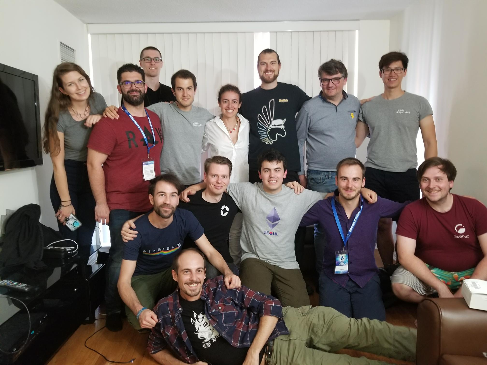

# Aragon DAC Jobs

As part of the ongoing efforts to build out the Aragon infrastructure, the Aragon Foundation and Giveth are building the Aragon DAC, a Decentralized Altruistic Community run using the Giveth DApp building out core Aragon infrastructure from the end user's perspective.  Read more about our formation [here](https://blog.aragon.org/aragon-dac-a-new-community-effort-to-foster-aragons-development-led-by-giveth/).

We are currently building 2 teams that will work closely together. The first is the Community R&D Campaign that will help end-users (=non-developers) experiment with using the Aragon Stack. Second is a core dev team that will focus on developing the Aragon codebase, implementing features especially needed by the users. Both teams are advised by experienced members of Giveth and Aragon One teams and will work closely with each other.

We invite you to join us in building a better world!

### Culture 🌍

-   We believe and fight for freedom.
-   We are open source only.
-   We promote transparency, communication and autonomy.
-   We advocate decentralization.
-   We encourage contributions to other open source projects within the crypto space to speed up the development of the ecosystem.
-   We are a technology project supported by a community. Our focus is taking input from the users to improve the product.
-   We are a blockchain based organization with no legal entity and a not-for-profit business model.

### Work conditions 🚀

-   Work with top minds from the ecosystem and build revolutionary products.
-   Fully remote positions. You choose your location, but with awareness of timezones.
-   You get paid via the Giveth DApp, in ETH and eventually ANT, DAI and other tokens.
-   You choose your level of involvement: advisory, part-time, full-time
-   We nourish curiosity and inspiration by supporting side projects.
-   1-3 month introductory period.

### Perks ⭐️

-   Work with an international team (free lodging in worldwide locations and local guides!)
-   Occasional off sites where we all can meet in a peaceful location to work and connect with the team and guests from the ecosystem (Next one is Thailand in Janurary).
-   Opportunities to attend and/or speak in relevant events.

### Openings 🙋🏾🙋‍👨👦👽

-   [Project Manager](openings/DAC-Project_Manager.md)
-   [Technical Writer](openings/DAC-Technical_Writer.md)
-   [UX Designer](openings/DAC-UX_Designer.md)

### Applying 📝

-   Write an email with any info you consider relevant to griff@giveth.io with the subject `${insert_position_here}` application.
-   The generic things we are looking for in the application are:
    -   A couple paragraphs explaining your involvement and experience in the blockchain community and how you qualify for the particular role.
    -   All the references to your past work
        -   GitHub for developers. Since we are open source only, we prefer applicants for developer positions to have a very active and healthy GitHub profile.
        -   Dribbble/Behance/portfolio for designers
        -   CV/LinkedIn for all positions
-   We really value people that have previously contributed to the project in a voluntary manner or that are community members.
-   We value what you can do and your attitude doing it, not where/whether you went to school or college.
-   More specific instructions for each position can be found in the job descriptions.

### Process 🤓

-   Submit Application - We'll review your application and we may ask you for more info.
-   Initial Interview - If there's a potential fit we'll schedule a call.
-   Meet the team - If we liked your submission you'll chat with other members of our team.
-   Offer - If we see a match we'll extend you an introductory offer.
-   Trial - Since we're remote we'll work together for a month or more before making the final decision.

