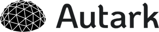

# Aragon Glossary

This page explains some of the terms commonly used within the Aragon ecosystem.

## **Aragon**

Aragon is a project to empower freedom by creating tools for decentralized organizations to thrive.

**Website:** [https://aragon.org](https://aragon.org)

## **The Aragon client**
The Aragon client is the flashship product of the Aragon project. It is an open source decentralized application that empowers users to create and participate in blockchain-based organizations. Organizations created using Aragon are digital-native and censorship-resistant.

**Website:** [https://app.aragon.org](https://app.aragon.org)

## **Aragon Network**
The Aragon Network is a DAO that is comprised of a network of DAOs. It is a blockchain-native jurisdiction that supports interactions between sovereign entities by incorporating limited liability using economic incentives. It can support both human-readable contracts as well as smart contracts.

**Website:** [https://aragon.org/network](https://aragon.org/network)

## **Aragon Association**
The Aragon Association is a non-profit entity that safeguards the values of the Aragon project by allocating the resources from the token sale towards funding activities and teams that move them forward.

**Website:** [https://aragon.org/project](https://aragon.org/project)

## **Aragon One**

Aragon One is a company formed by the founders of the Aragon project, building the tools and community necessary for the project to succeed.

**Website:** [https://aragon.one](https://aragon.one)

## **Aragon One blog**

The Aragon One blog can be found at [https://blog.aragon.one](https://blog.aragon.one). Contains blog posts from the Aragon One team.

**Website:** [https://blog.aragon.one](https://blog.aragon.one)

## **Autark**

Autark is an organization that established for the purpose of advancing life on Earth, with a special focus on DAOs, Aragon, worker-autonomy, and access to tools that support the global development of complex mega-projects.

**Website:** [https://www.autark.xyz/](https://www.autark.xyz/)

## **Autark blog**

The Autark blog can be found at [https://blog.autark.xyz](https://blog.autark.xyz). Contains blog posts from the Autark team.

**Website:** [https://blog.autark.xyz](https://blog.autark.xyz)

## **Aragon Chat**
A place to have discussions and to chat about all Aragon related things. An open source chat server built on the [Rocket Chat](https://rocket.chat/) platform.

**Website:** [https://aragon.chat](https://aragon.chat)

## **Aragon Wiki**
The home to Aragon-related resources and assets such as historical information, user-related and general documentation, design items, job listings, tutorials and other related material.

**Website:** [https://wiki.aragon.org](https://wiki.aragon.org)

## **Aragon project blog**

The Aragon project blog can be found at [https://blog.aragon.org](https://blog.aragon.org). Contains blog posts related to the project under categories [Announcements](https://blog.aragon.org/tag/announcements/), [Product](https://blog.aragon.org/tag/product/), [Governance](https://blog.aragon.org/tag/governance/), [Research](https://blog.aragon.org/tag/research/), [Aragon Network](https://blog.aragon.org/tag/aragon-network/) & [Community](https://blog.aragon.org/tag/Community/).

There are also collections which contain posts on specific topics. These are [Transparency Reports](https://blog.aragon.org/tag/transparency-reports/), [Development Updates](https://blog.aragon.org/tag/development-updates/), [Nest Updates](https://blog.aragon.org/tag/nest-updates/) & [Governance Proposals](https://blog.aragon.org/tag/governance-proposals/).

**Website:** [https://blog.aragon.org](https://blog.aragon.org)

## **Aragon Forum**
A forum specifically to engage in long-form discussions related to Aragon's research efforts including governance, economics, and token engineering.

**Website:** [https://forum.aragon.org/](https://forum.aragon.org/)

## **Aragon Developer Portal**
Home to developer documentation, guides & tutorials on the infrastructure and tools built by Aragon.

**Website:** [https://hack.aragon.org](https://hack.aragon.org)

## **Developer glossary**
For developer tools and frameworks like aragonOS or aragonCLI, you can check out the [developer glossary](https://hack.aragon.org/docs/glossary.html).
