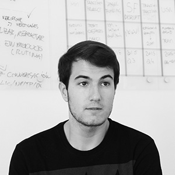

# **History & Vision**

Luis and Jorge have been dreaming of a decentralized world for years. They met via Twitter when they were only 15 years old, and immediately started building products together.

At the age of 17, they prototyped a fully decentralized Internet replacement by using mesh networks, blockchain technology, and protocols like Bluetooth LE and WiFi Direct.

[Stampery](https://stampery.com)—Luis’ latest company—made blockchain timestamping accessible, and has worked with institutions like the Estonian government, Microsoft and Telefonica. It participated in TechCrunch Disrupt and was backed by billionaire Tim Draper.

Luis has also been recognized as a [30 Under 30 by Forbes](https://www.forbes.com/30-under-30-europe-2016/technology/#6662a3e4a4b3) and [Innovator Under 35 by the MIT](http://www.innovatorsunder35.com/innovator/luis-cuende).

Before building Aragon, Luis and Jorge were in Silicon Valley working on solving the problem of patent trolls with Unpatent. After figuring out how broken the underlying infrastructure of innovation is—patent trolls thriving, Donald Trump winning the elections, bureaucracy eating entrepreneurship—they decided to focus all of their time in building the infrastructure that new companies and organizations will run on top of.

When talking about Aragon, taking a step back and thinking about the why of organizational structures like companies is a sane move.

Firms or companies exist in order to create value by using resources to create products or provide services.
However, intermediaries and third parties such as governments decrease the output of those organizations by imposing restrictions and creating complex regulatory frameworks.

Aragon was born to disintermediate the creation and maintenance of companies and other organizational structures.

Luis and Jorge were very inspired by Nobel prize Ronald Coase and his amazing paper [The Nature of the Firm](https://en.wikipedia.org/wiki/The_Nature_of_the_Firm) and Yochai Benkler's [Linux and the Nature of the Firm](http://www.benkler.org/CoasesPenguin.html). Both explore the concept of companies.

At Aragon, we believe that the blockchain and the Internet are changing the incentives for companies to exist, and we are building tools for the next generation of companies that will take advantage of these changes.

However, for decentralized organizations to be widespread, we need to make sure that they are easy to use, upgradeable/durable, and able to resolve human disputes.

We want to solve—either us or partnering with others—those points in order to make decentralized organizations widespread.

And, thanks to the Aragon client and the Aragon Network, we can solve those points.
