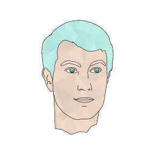
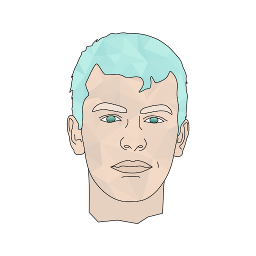
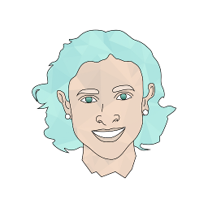
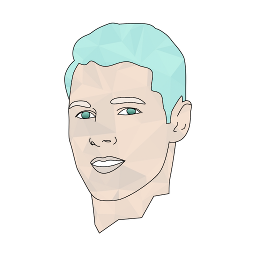
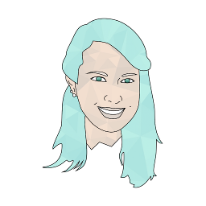
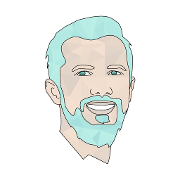
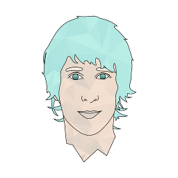

# Aragon One Team

## Founders

### **CEO / Chief Executive Officer**: [Luis Cuende](https://twitter.com/licuende)

> Luis has been awarded as the best underage European programmer in 2011, is a [Forbes 30 Under 30](https://www.forbes.com/30-under-30-europe-2016/technology/#6662a3e4a4b3), a [MIT TR35](https://www.innovatorsunder35.com/the-list/luis-cuende/) and was an Advisor to the VP of the European Commission.

> He cofounded the blockchain startup [Stampery](https://stampery.com/). Prior to founding startups, he created the world's first Linux distribution with facelogin.

> Advisor to a few crypto projects that awake his curiosity.

### **CTO / Chief Technical Officer**: [Jorge Izquierdo](https://twitter.com/izqui9)

> Curious hacker, creator of multiple apps for iOS and macOS. Reached App Store's #2. Always tinkering with new tech. Named as a [2017 class of Thiel Fellows](https://www.businesswire.com/news/home/20170616005607/en).

> Already convinced about the decentralized future of the Internet, he has been building toy projects such as a [mesh network](https://github.com/izqui/net) or a small [blockchain implementation](https://github.com/izqui/blockchain) since 2014.

___

## **Non-dev Team**

### Ecosystem development at Aragon One: **[María Gómez](https://twitter.com/MyPaoG)**

> María Gómez is a former corporate lawyer. She worked several years in the M&A and corporate finance practice. Currently she works on ecosystem development for Aragon One.

### **Communications at Aragon One**: [Tatu Kärki](https://twitter.com/smokyish)

> Tatu started his crypto career as an intern and as a Community Manager at [Status](https://status.im/) before joining Aragon One. In the end of 2017 he transitioned into the role of Communications Lead at Aragon. He has been featured in [The Decentralized Marketing Organization](https://www.neverstopmarketing.com/decentralized-marketing-organization/) book.

### **Researcher at Aragon One**: [Luke Duncan](https://twitter.com/lkngtn)

> As Research Lead Luke explores how blockchains enable novel forms of governance as well as how existing forms may perform in the unique context of smart-contract enabled systems. He is concerned by the rapid pace of technological advancement coupled with a lack of improvement or decline in our social and political institutions--but he is optimistic that blockchains might help us avoid a catastrophic future.

### **Community at Aragon One**: [John Light](https://twitter.com/lightcoin)

> John Light handles Community at Aragon One. He is also a co-founder of Bitseed, author of Bitcoin: Be Your Own Bank, free software advocate and contributor, and advisor to cryptocurrency startups and investors. In his free time, John enjoys a diverse range of sensory stimulation and is an avid reader and writer on the topics of peer-to-peer technology, philosophy, and culture.

### **Design at Aragon One**: [Jouni Helminen](https://twitter.com/dharmaone)

> Handling design at Aragon One, Jouni looks after the UI/UX of various Aragon projects, as well as the Aragon brand. Earlier, he was a Design Lead on Ubuntu at Canonical, and a consultant helping tech, finance and fintech companies innovate with design. A proponent of user centred design, Jouni likes to approach design from the viewpoint of the users of the product. He is a firm believer in decentralisation, but thinks it will gain adoption much faster if the user experience is simpler and more intuitive.

### **Operations at Aragon One**: [Alexa Weaver](https://twitter.com/alexa_rwr)

> Alexa is a business generalist who helps out with all things operations, logistics, and accounting at Aragon. Alexa has a background working in Washington DC non-profits and research organizations, where she focused on government transparency and criminal justice reform. After being introduced to bitcoin in 2011 and falling down the rabbit hole - little by little she became completely convinced that Ethereum and similar P2P technologies can revolutionize human interactions and organization.

## **Dev Team**

### **Product Manager at Aragon One**: [Chris Remus](https://twitter.com/cjremus)

> Chris enjoys finding balance. The challenge of balancing product needs, sometimes conflicting, of diverse stakeholders, excites him. He's energized by finding the balance between implementing structure that's empowering, not stifling. He's a reformed management consultant feeling excited to do work he enjoys, after doing work he didn't for way too long. He believes wellness and productivity can form a virtuous, rather than destructive cycle He caught the blockchain brain virus because of a sticker on a mailbox in Brooklyn, NYC. He helps Aragon build products that enable others to create unstoppable organizations.

### **UI & Interaction Developer at Aragon One**: [Pierre Bertet](https://twitter.com/bpierre)

> Pierre is UI developer at Aragon One. His role is to ensure the interfaces of Aragon projects are fast, consistent, accessible and delightful. Passionate about crafting high quality products, his love for Free Software and the World Wide Web has led him to work for various companies over the years. Before Aragon, he was working on the Ubuntu interface at Canonical.

### **Lead Developer at Aragon One**: [Brett Sun](https://twitter.com/sohkai)

> Always curious, always an ice hockey fanatic. When Brett's not gushing at cartoons or his Calgary Flames as anon, he's probably doing something away from the keyboard. Maybe he's trying to pick up the pieces on his long lost Chinese heritage or busy embarrassing himself in the outdoors.

### **Solidity Engineer at Aragon One**: [Bingen Eguzkitza](https://twitter.com/bingentxu)

> Bingen is a Solidity Engineer currently working on Aragon Labs, trying to make the most experimental ideas a reality, with the guidance of Luke. Long time open source -software, hardware and data- passionate, he could never imagine while he was reading Kropotkin at the age of 16 that his libertarian curiosity would be fulfilled years later at Aragon.
