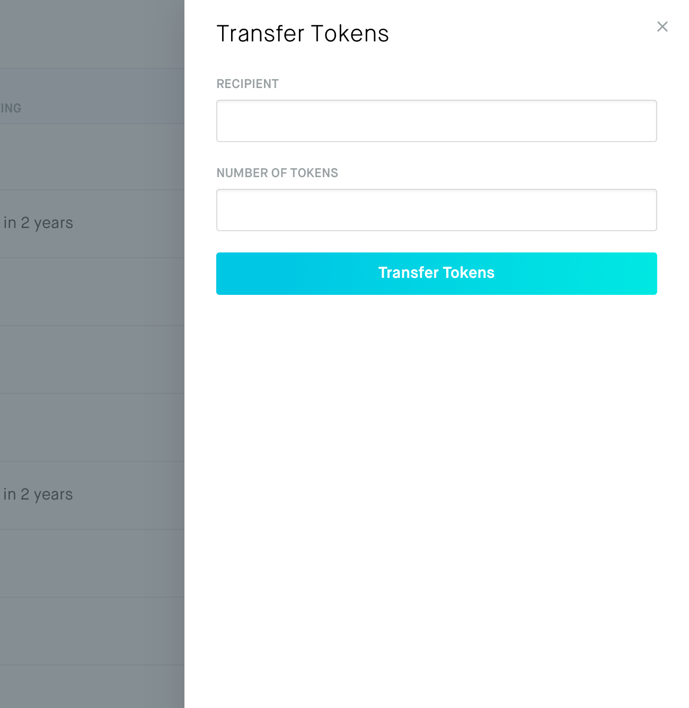
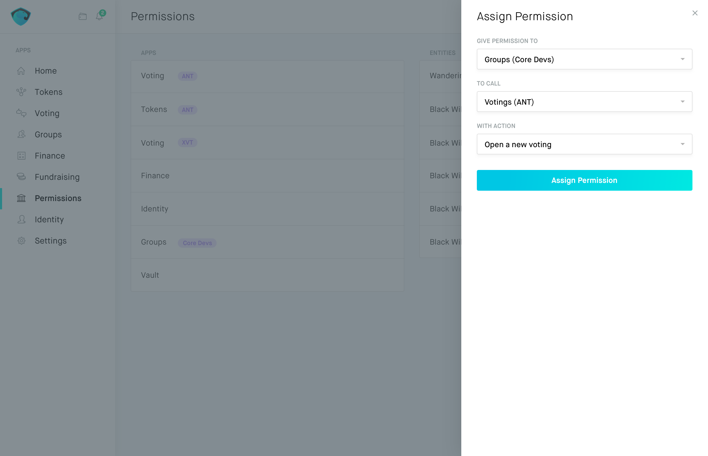
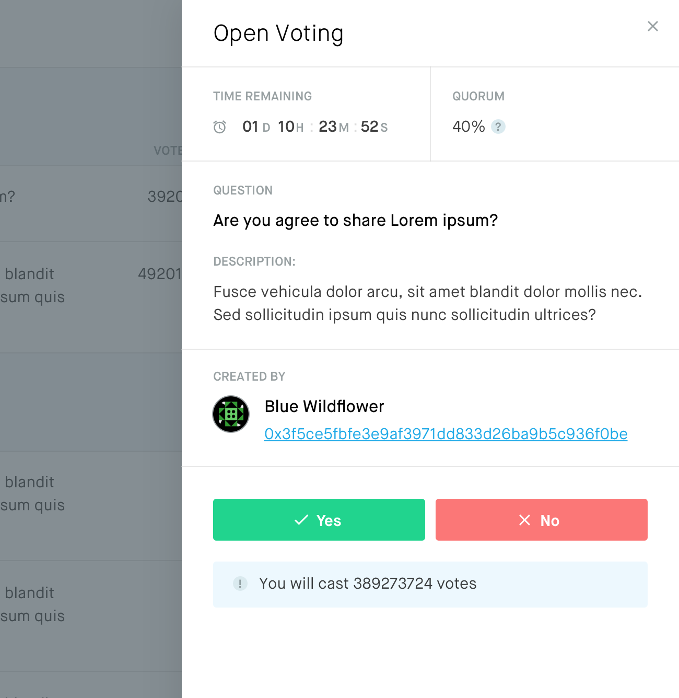
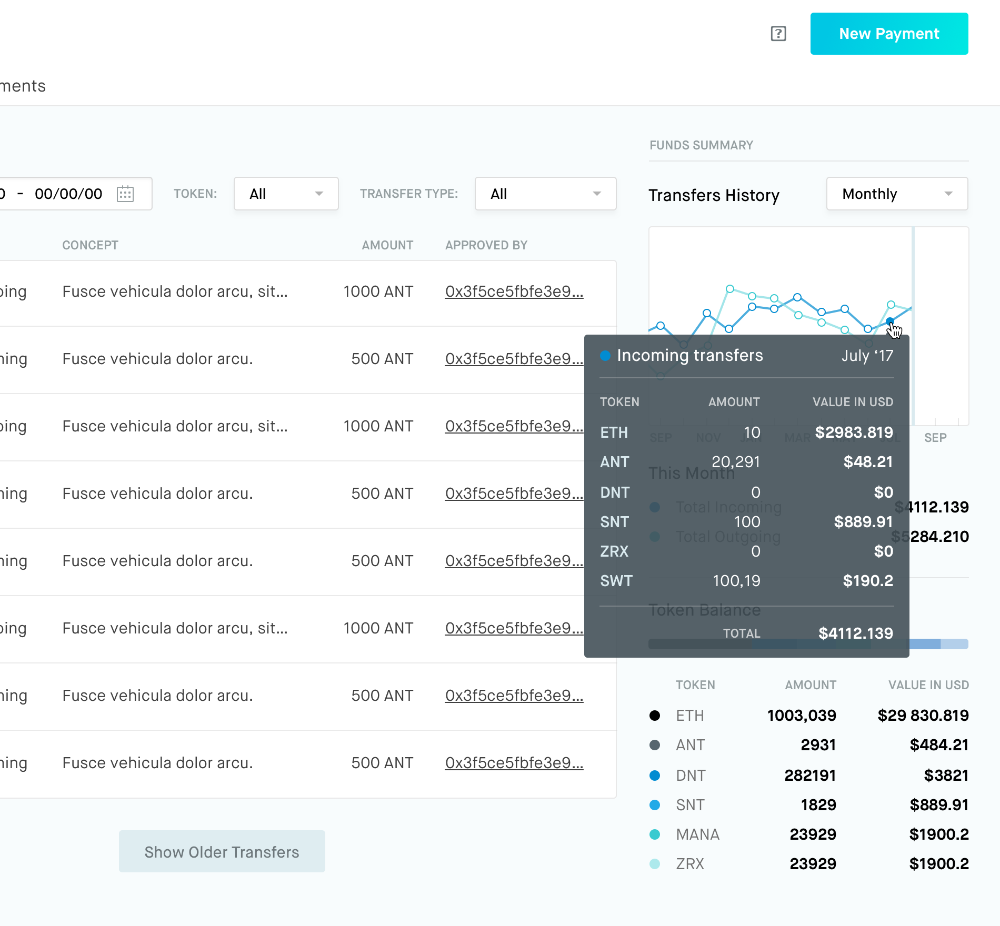

# Aragon Core

<h2>Decentralized application to run your organization</h2>

!!! info
    **Current version**: Beta v0.5  
    **Codename**: The Architect  
    **Network**: Rinkeby  

    Aragon Core v0.5 is the first release powered by aragonOS. The new smart contract operating system for protocols and DApps. Thanks to aragonOS, Aragon Core v0.5 is the most powerful way to create and manage any type of decentralized organizations.

**Your window to the decentralized era**

Aragon is no longer merely a way to run your company using the blockchain.

We went very deep into exploring what crypto means for humankind — and found something way more universal than just more efficient companies.

Crypto is the final step in making globalization truly happen. And for human society to become completely digital.

Before, our identities, our assets, our companies were ultimately controlled by a set of institutions and nation-states. Entities that could use intimidation and even violence to reclaim ownership over them. With crypto, you can defend even against those kind of bad actors. Just by using cryptography to generate your private keys that no one else in the world knows.

For the first time in history you can be free from the shackles of someone way more influential than you. It breaks all the power dynamics we as a society have wrapped our heads around.

Aragon is a tool for all of humanity to organize. It's vital for us that the project is ready for this tectonic shift in how society works and the **new organizational structures that will blossom** from it.

Thanks to aragonOS, Aragon Core is as adaptable as it gets. You can use Aragon to run a crypto project, an open source project, a non-profit organization, a startup, a corporation... or even your own personal DAO. One that owns your assets and lets you do more complex operations than a simple Ethereum account. It even allows you more freedom and choices than a multi-signature wallet through utilizing the crowd.

You can expand its functionality by **installing additional new apps that will enrich your Aragon experience**. For example, you could install a new finance app with permissions to automatically execute payments, up to a certain amount, on your behalf by using your Vault app, simply with a few clicks.

If you are a developer, you can even go under the hood and **write your own aragonOS-compatible apps**!

Anyone wishing to start running their test organization can start **right now**!

<h1>**https://app.aragon.org**</h1>

___

Managing your organization has never been easier

## Transfer Tokens

!!! abstract "Tokens represent your stake in the organization"
    

    Your organization is in control of its funds. Transfer and assign them according to your personal needs without artificial limitations

!!! note ""
    
    

    It's your organization. Make it work for you
    

 |  |  |
:----|:----|:----|
Aragon organizations are powered by aragonOS and fully customizable to fit your needs | You set the rules of how and when actions are prompted and enacted | Code is open source. As a developer you can modify it to match your specific use case |

!!! question "Decision-making by voting"
    
    Use voting for more effective results. Votes are a secure, transparent and unforgeable way to come to a decision on major issues

!!! success "Instant payments in a few clicks"
    

    Adding a new employee to your organization and payroll is as easy as creating a new recurring payment

## Accounting

!!! abstract "Tamper-proof, effective accounting"
    

    > Every transaction is recorded and can be verified on the blockchain at any given time

    Unprecedented level of transparency can be gained through the use of a public blockchain to engrave every entry permanently on the ledger

    Pre-established rules can automatically define your quarterly spending and budgeting

## Permissions

!!! snippet "Flexible and resilient privilege escalation"
    

    > Fine-grained permissions deliver the freedom to create an organization that will work for you

    Permissions can be granular and assigned in fine detail. You can choose to give people a certain degree of control over the organization and privileges can be escalated easily through a voting or different mechanisms if the person isn't allowed to directly perform a desired action

    By assigning different permissions to people, you can create the kind of organizational structure that is best suited for your needs
