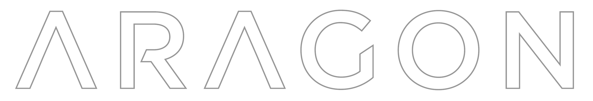
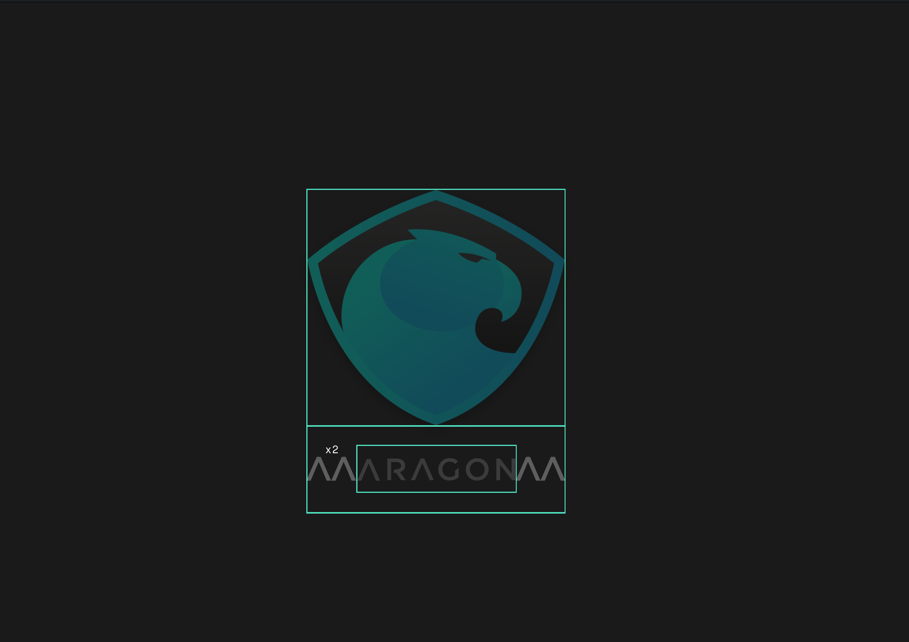
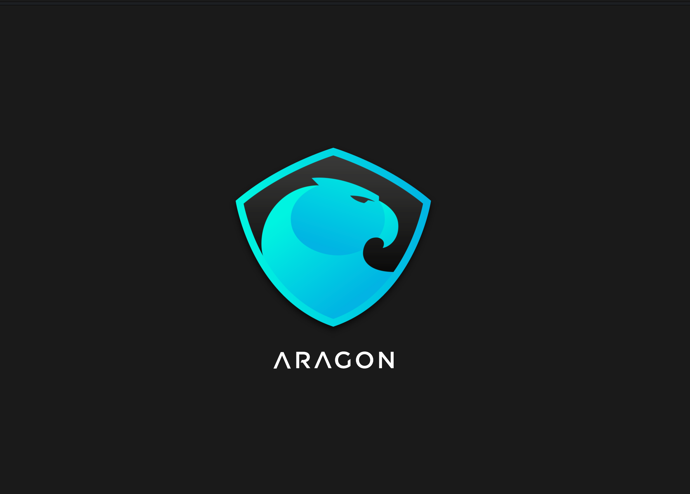
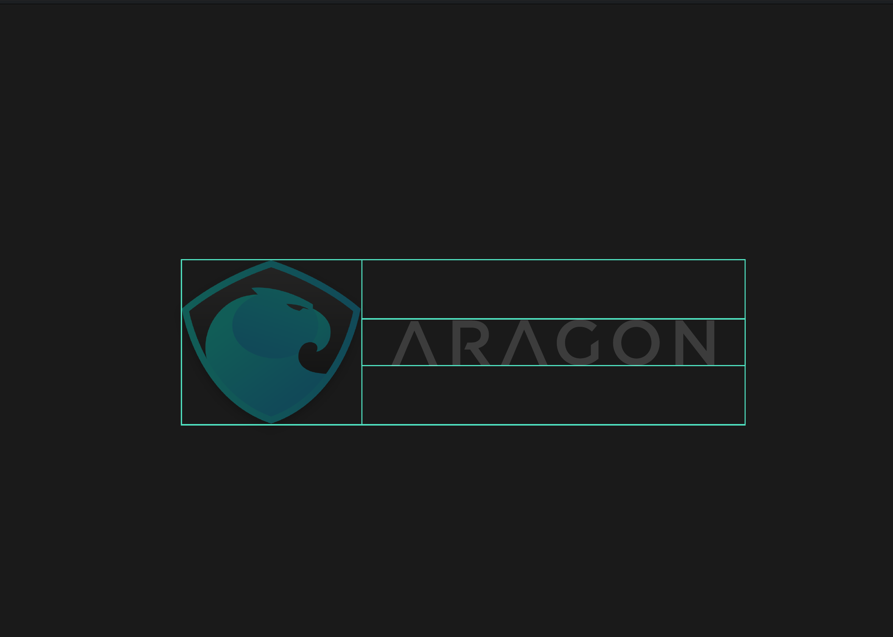
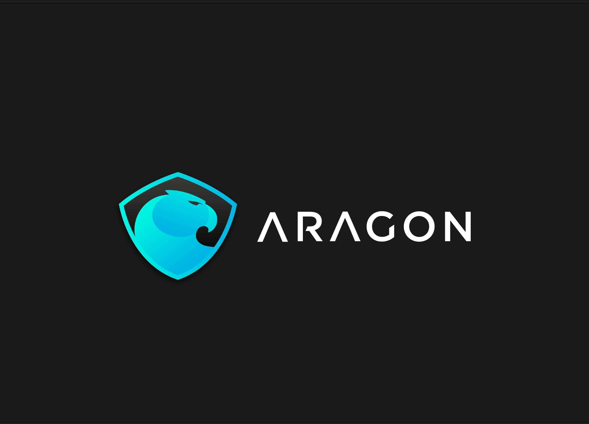
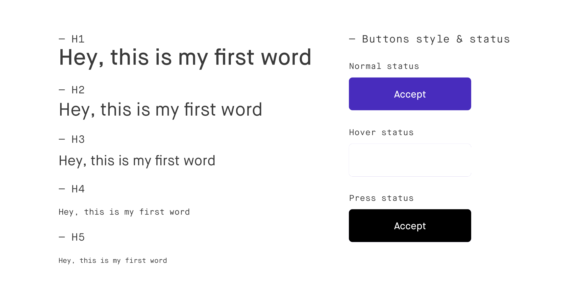

# Identity Guidelines

_[Download as PDF](Identity_Guidelines.pdf)_

## Contents

- **[Welcome](#welcome)**  
- **[Inspiration](#inspiration)**  
- **[Logo](#logo)**  
- **[Isotype](#isotype)**  
- **[Color palette](#color-palette)**  
- **[Typography](#typography)**  

## Welcome

Welcome to the fresh Aragon Brand Guidelines.  
This document contains all you need to know about how the new identity should be used in different supports.

We hope you enjoy getting to know our brand better.

## Inspiration

## Logo

### Structure

### Color

## Isotype

### Structure

### Spaces & Scale

## Color

### Color palette

## Typography

## Iconography

### Icon Family

## UI Styles

## Thanks

**- Work by Owi Sixseven®**
