# How to claim an Aragon bounty using Status Open Bounty

## Step 1. Create an ERC-20 compatible Ethereum wallet

If you already have an ERC-20 compatible Ethereum wallet, you can skip ahead to Step 2.

**We recommend either [MyCrypto](https://mycrypto.com/) or [MetaMask](https://metamask.io/) for ease of use. Be sure to copy and store your “seed phrase” or “private key” in a safe place to ensure that you do not lose access to your funds.**

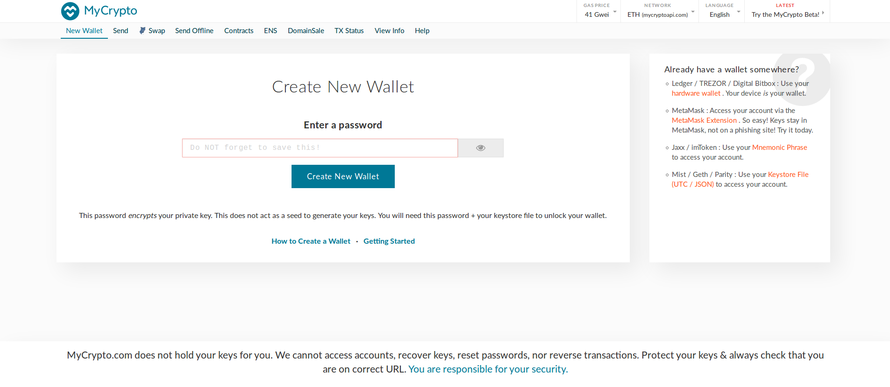

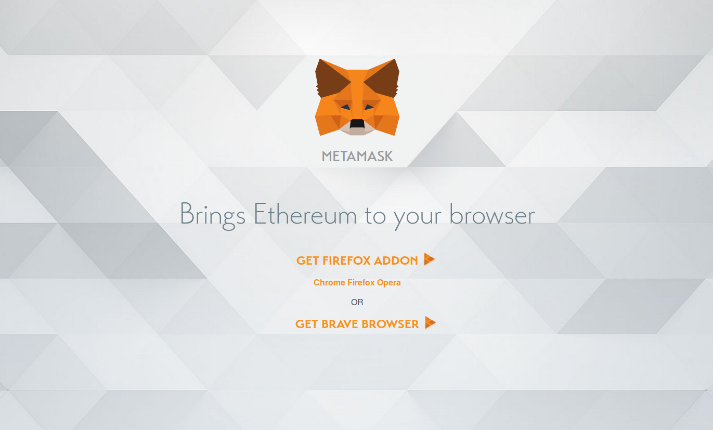

## Step 2. Sign up for a GitHub account

If you already have a GitHub account, you can skip ahead to Step 3.

**Visit [https://github.com](https://github.com/) and click the “Sign up” button to create a new account.**

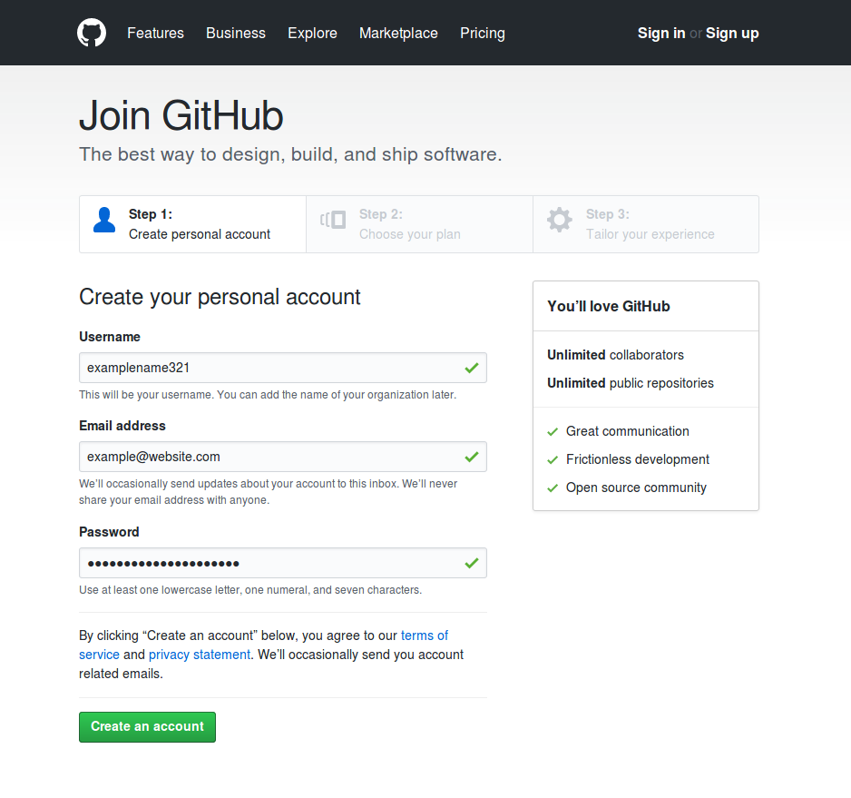

**Visit the “Security” page in your account “Settings” and turn on “Two Factor Authentication”.**

This will help prevent your account from getting compromised by hackers.

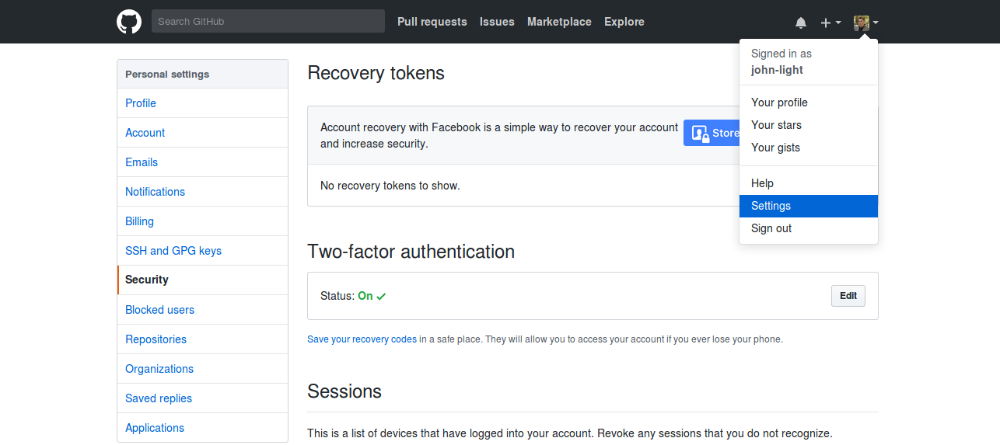

## Step 3. Log in to Status Open Bounty with your GitHub account

If you are already logged in to Status Open Bounty, you can skip ahead to Step 4.

**Visit [https://openbounty.status.im](https://openbounty.status.im/) and click the “Log In” button.**

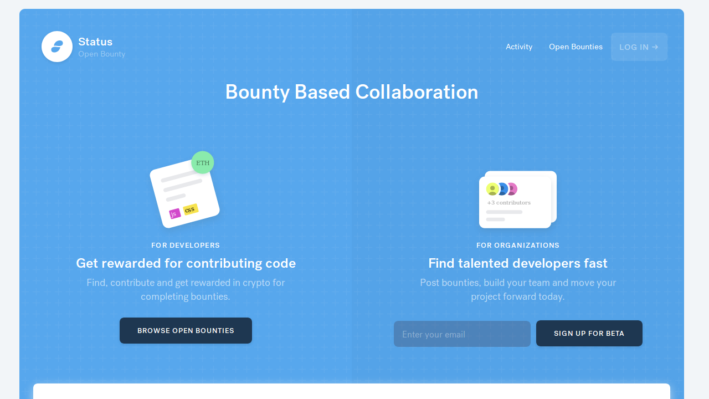

**Click the “Authorize status-open-bounty” button.**

This will connect your GitHub account to Status Open Bounty, enabling easy bounty payouts.

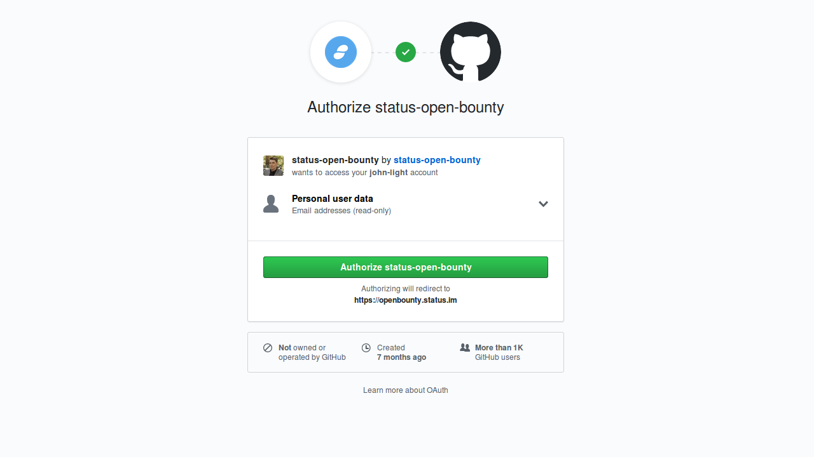

## Step 4. Add your Ethereum address to your Status Open Bounty profile

If you have already added your Ethereum address to your Status Open Bounty profile, you can skip ahead to Step 5.

**Click “My payment details” in the top menu and copy+paste the address of your ERC-20 compatible Ethereum wallet into the text field.**

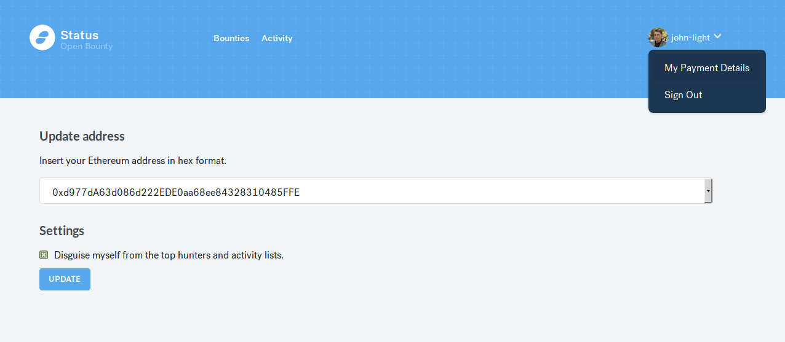

You can also click the box to “Disguise myself from the top hunters and activity lists” if you do not want your GitHub profile to show up on the public Status Open Bounty website.

**Click the “Update” button to save your settings.**

## Step 5. Filter search results to show only Aragon bounties

This isn’t necessary but will make it easier to look through all of the open Aragon bounties.

**On the “Bounties” page, click the “Owner” search filter and select the “Aragon” box.**

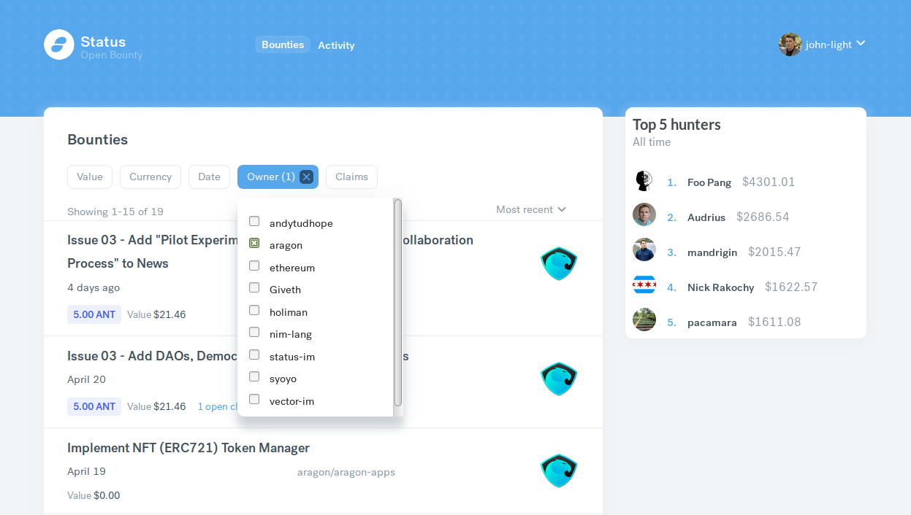

## Step 6. Click on a bounty you are interested in and review the details of the bounty

This bounty is in the “aragon-monthly” repo of the Aragon GitHub organization. It has a bounty of 5 ANT for submitting a news link to the Aragon Monthly newspaper.

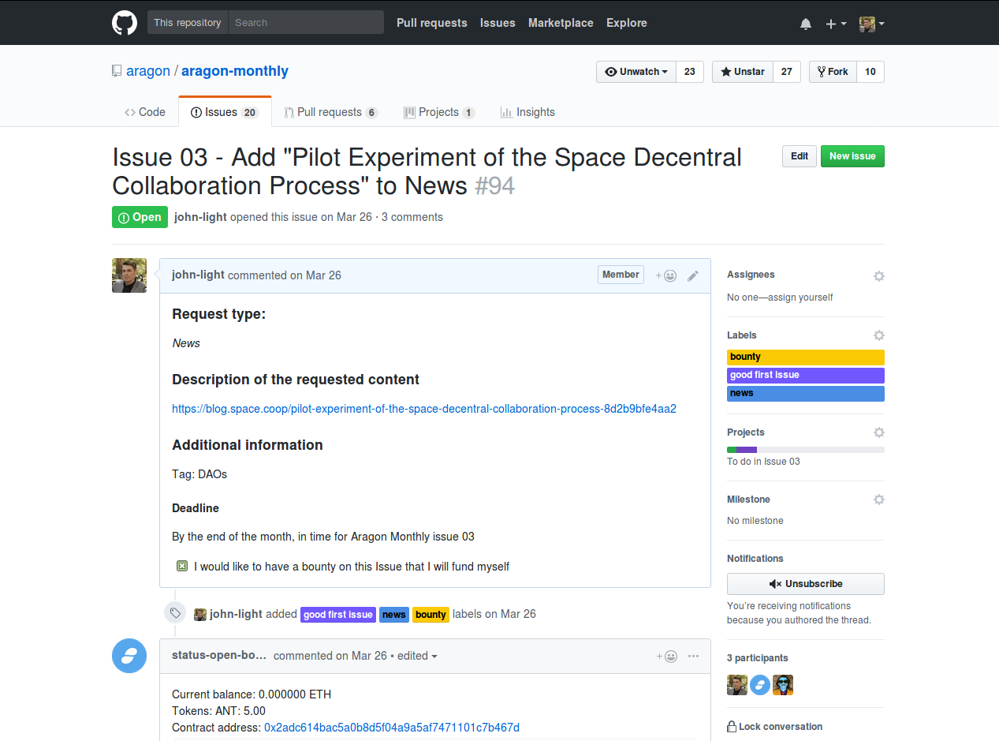

**Click on the “Code” tab to find the “README.md” file that tells you about the repository that hosts the bounty you are interested in. Also see if there is a “CONTRIBUTING.md” document with specific instructions about how to contribute to the repo.**

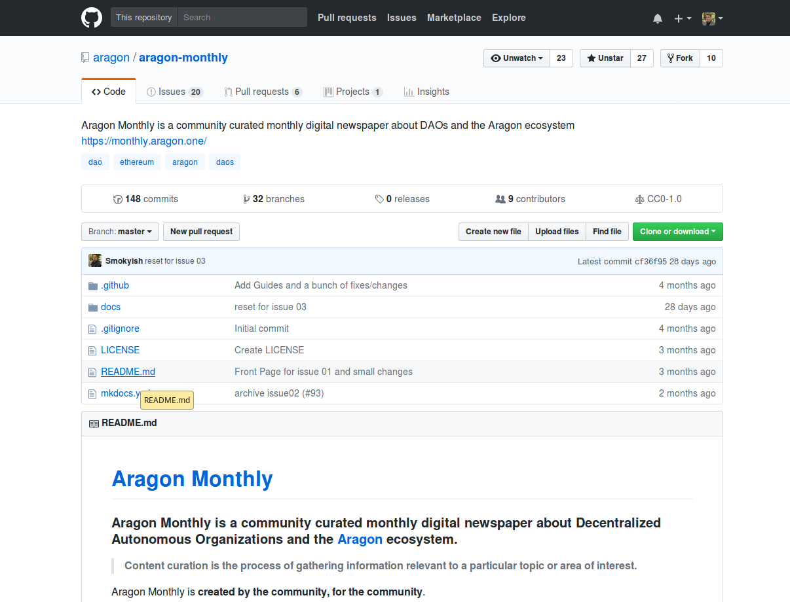

In this example, the instructions for contributing are located in the README.md file of the aragon-monthly repo. In other repos, the instructions may be located in a CONTRIBUTING.md file.

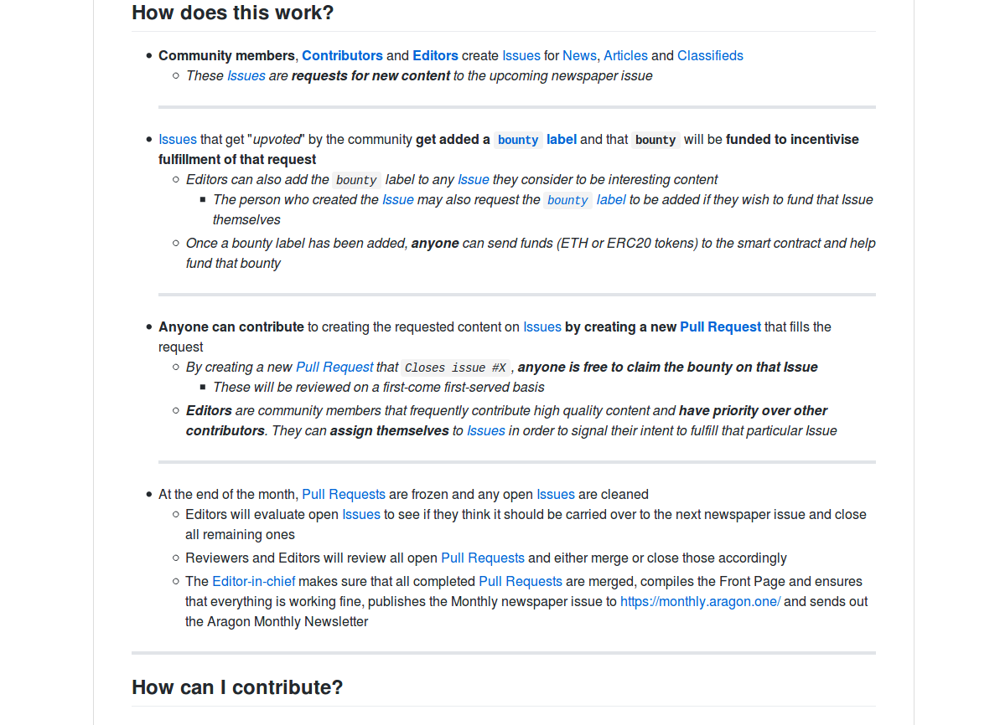

## Step 7. Submit a pull request to the repo hosting the bounty with a correct solution to the issue

You can either use the GitHub Web UI, a Desktop Git UI, or a Command Line Interface text editor to submit your Pull Request. If you have never used Git or GitHub before, there is a helpful “Git for beginners” guide [here](https://handbook.enspiral.com/guides/github_for_beginners.html) and a more in-depth guide [here](https://services.github.com/on-demand/).

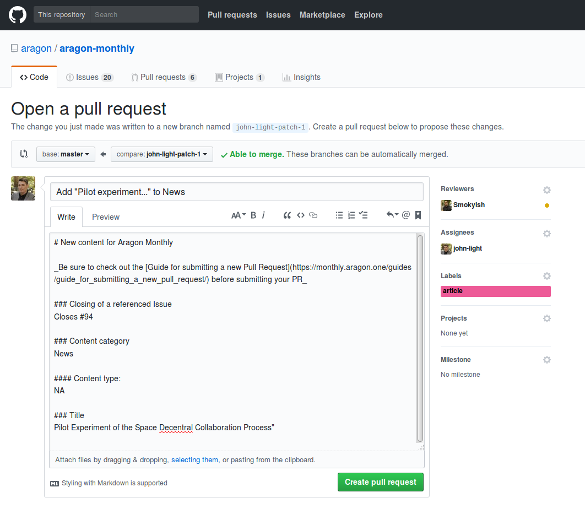

If your Pull Request is accepted and merged, then the Status Open Bounty app will pay out the advertised bounty to the address that you added to your profile in Step 4.

**Congratulations! You’ve just earned your first Aragon bounty.**
