# Aragon Artwork

Different kinds of resources, from *Powered by Aragon* icons to graphic resources to be used in blog posts etc.

## Powered by Aragon

> _Contributed by [@elioqoshi](https://github.com/elioqoshi)_

> [Dark Color SVG](Powered_By/SVG/Powered_By_Dark_Color.svg) | [Dark Color PNG](Powered_By/PNG/Powered_By_Dark_Color.png)

___
> [Dark Monochrome SVG](Powered_By/SVG/Powered_By_Dark_Monochrome.svg) | [Dark Monochrome PNG](Powered_By/PNG/Powered_By_Dark_Monochrome.png)

___
> [Light Color SVG](Powered_By/SVG/Powered_By_Light_Color.svg) | [Light Color PNG](Powered_By/PNG/Powered_By_Light_Color.png)
[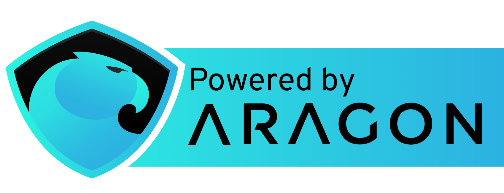](Powered_By/PNG/Powered_By_Light_Color.png)
___
> [Light Monochrome SVG](Powered_By/SVG/Powered_By_Light_Monochrome.svg) | [Light Monochrome PNG](Powered_By/PNG/Powered_By_Light_Monochrome.png)

## General

___
[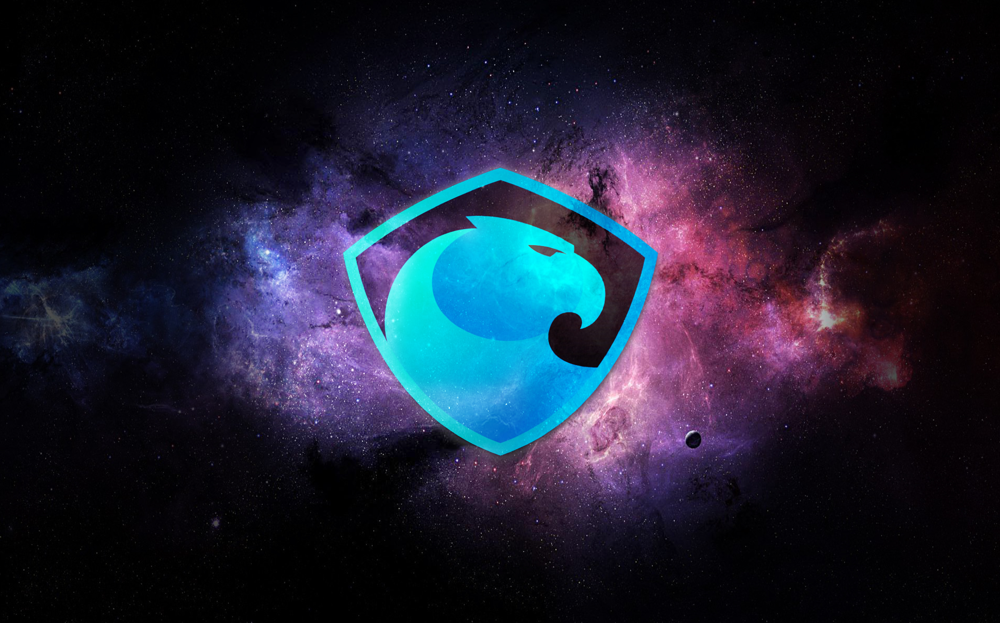](basic/02.jpg)
___
[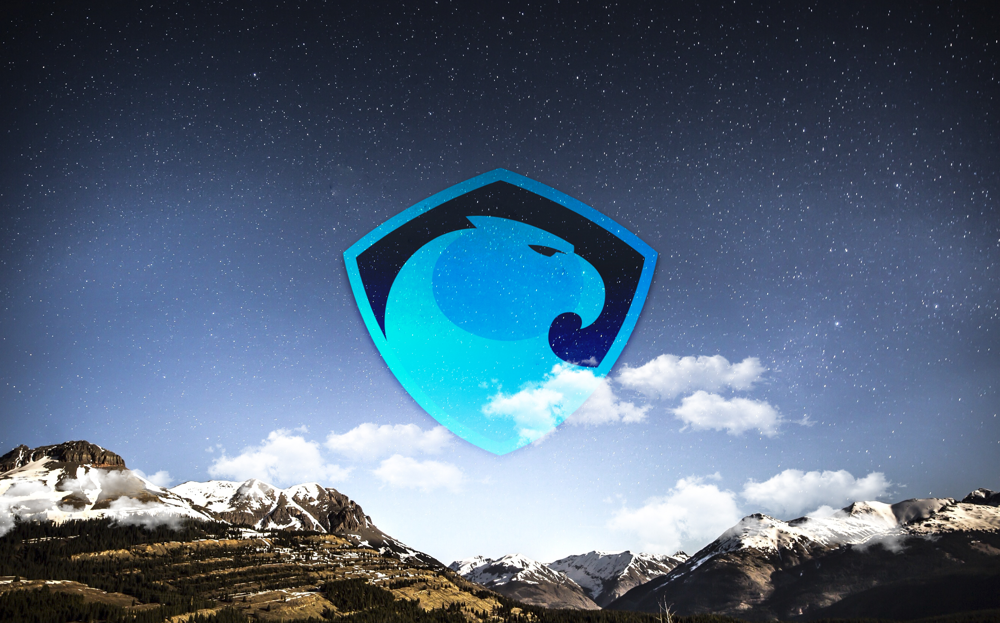](basic/03.jpg)
___
[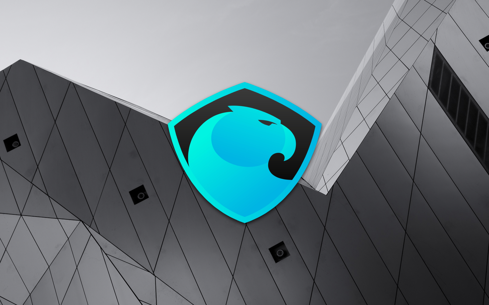](basic/04.jpg)
___
[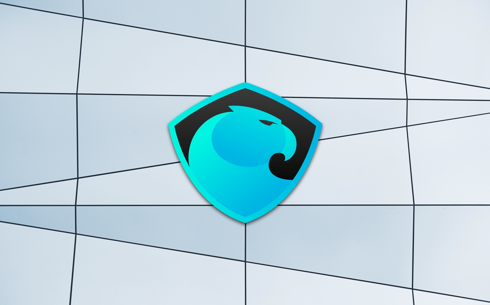](basic/05.jpg)
___
[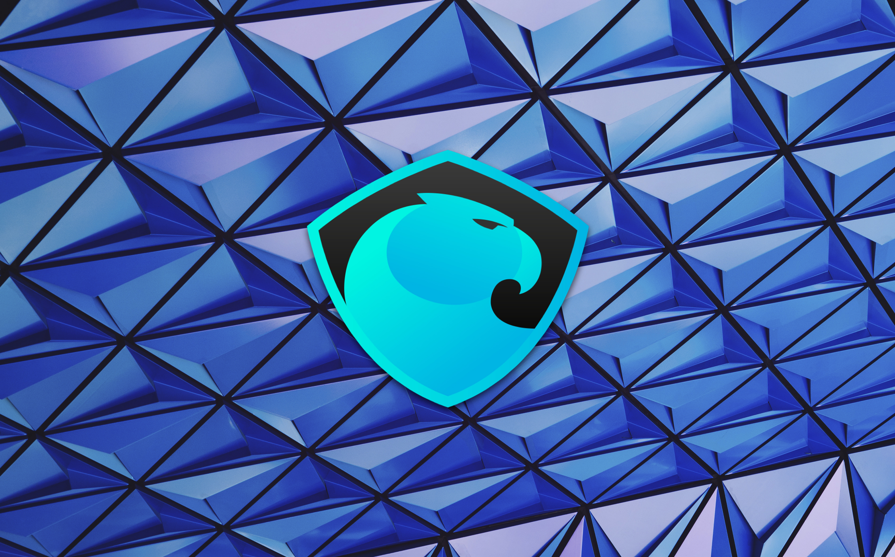](basic/06.jpg)
___
[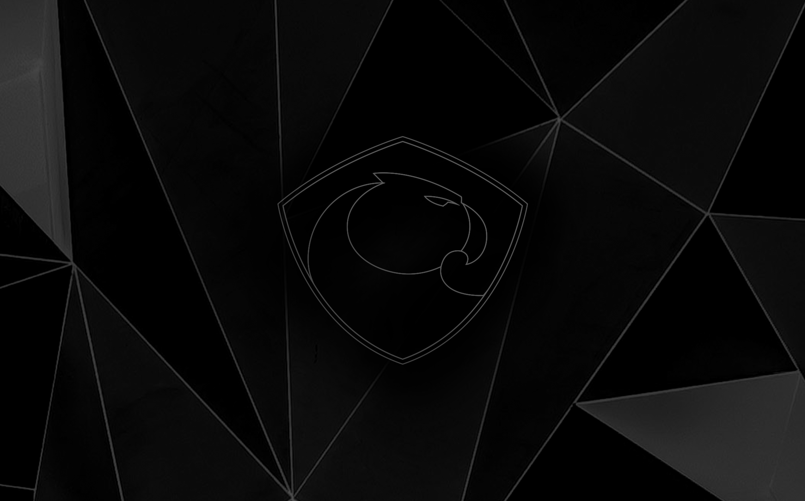](basic/07.jpg)
___
[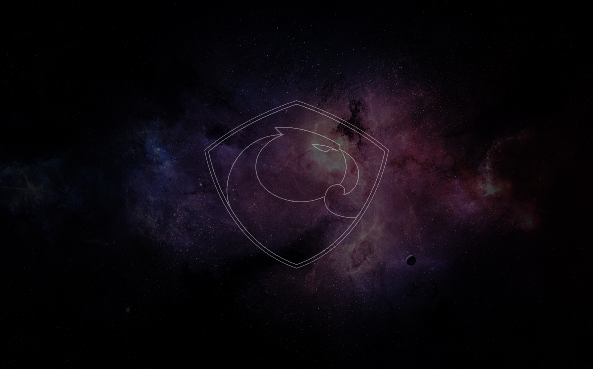](basic/08.jpg)
___
[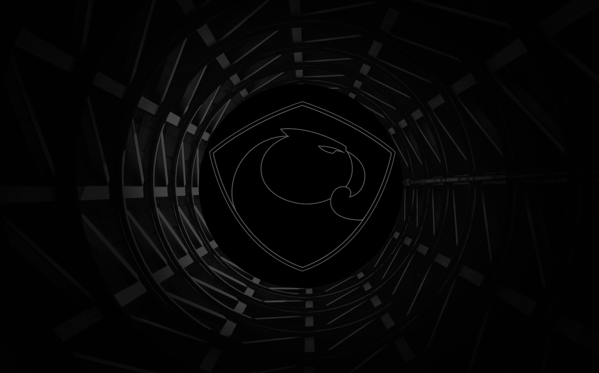](basic/09.jpg)
___
[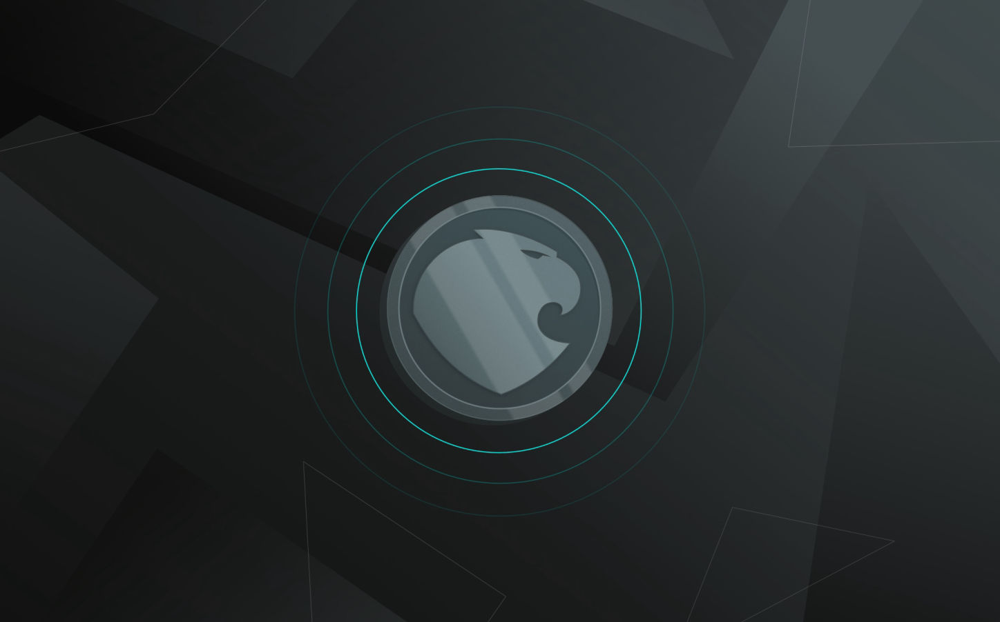](basic/10.jpeg)
___

___

___

___

___
[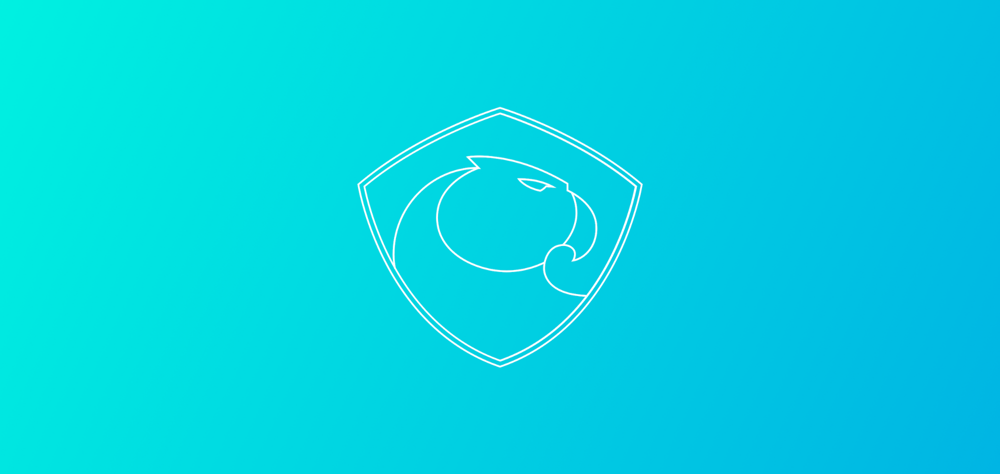](basic/15.png)
___

___

___
## Aragon Network Token

___
[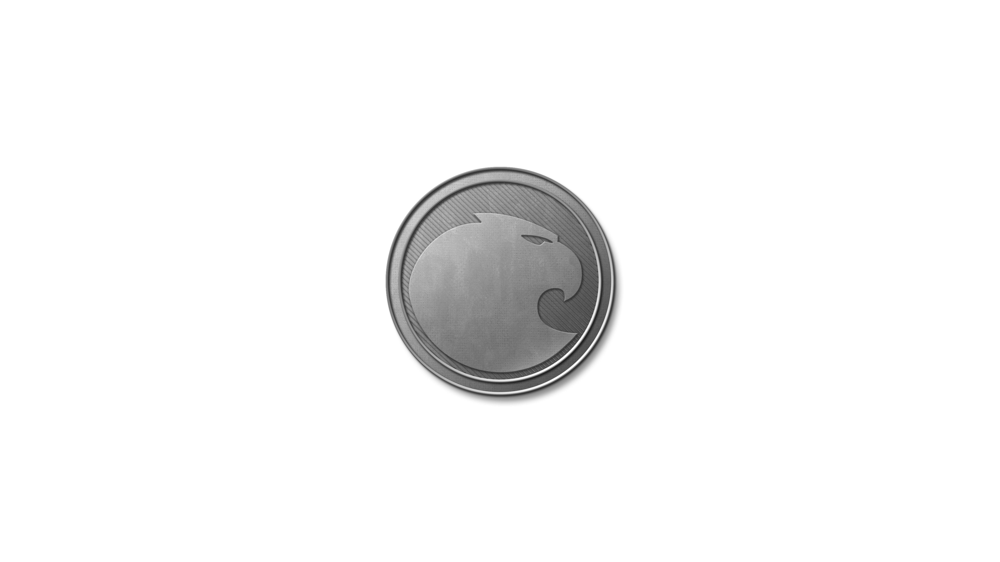](ANT/ANT02.png)
___
[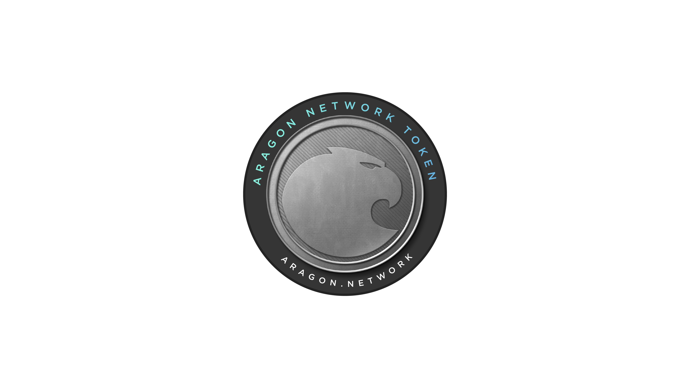](ANT/ANT03.png)
___
[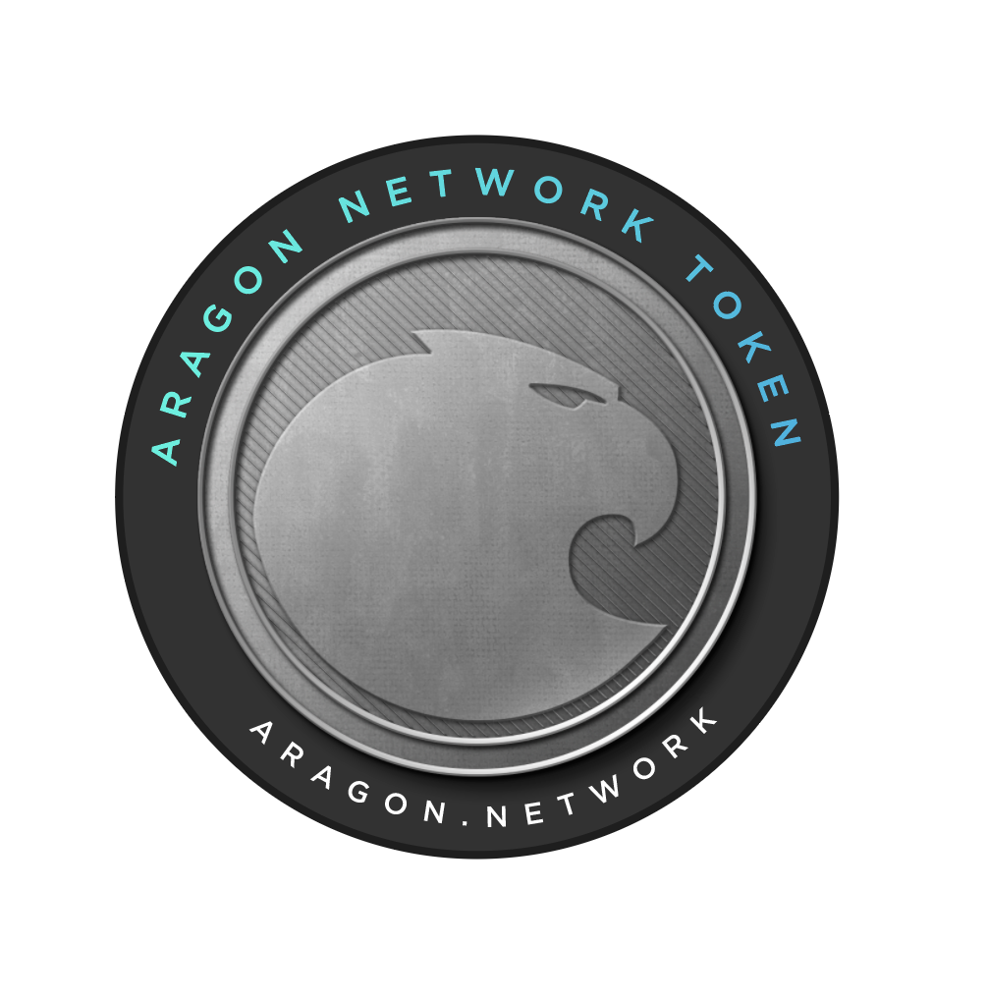](ANT/ANT04.png)
___
## Aragon Network Jurisdiction

## Aragon Company Registry

[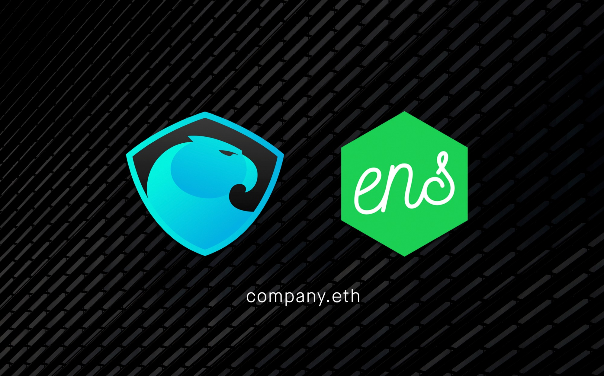](Aragon_Company_Registry/Aragon_Company_Registry.jpeg)

## Aragon Chat

## Aragon Nest

[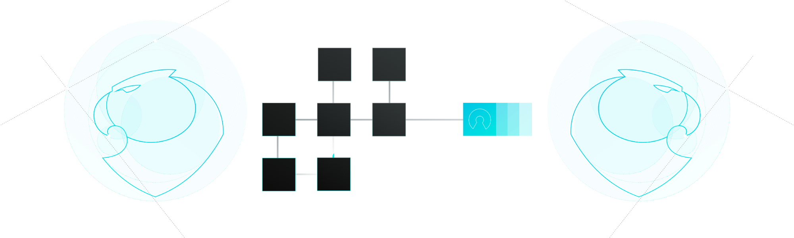](Nest/01.png)

## Gradient Background

