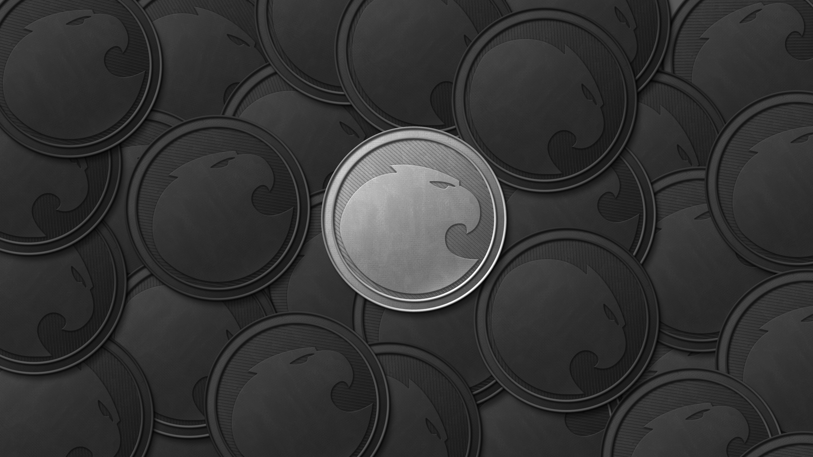

# Aragon Artwork

Different kinds of resources, from *Powered by Aragon* icons to graphic resources to be used in blog posts etc.

## Powered by Aragon

> _Contributed by [@elioqoshi](https://github.com/elioqoshi)_

> [Dark Color SVG](Powered_By/SVG/Powered_By_Dark_Color.svg) | [Dark Color PNG](Powered_By/PNG/Powered_By_Dark_Color.png)

___
> [Dark Monochrome SVG](Powered_By/SVG/Powered_By_Dark_Monochrome.svg) | [Dark Monochrome PNG](Powered_By/PNG/Powered_By_Dark_Monochrome.png)

___
> [Light Color SVG](Powered_By/SVG/Powered_By_Light_Color.svg) | [Light Color PNG](Powered_By/PNG/Powered_By_Light_Color.png)

___
> [Light Monochrome SVG](Powered_By/SVG/Powered_By_Light_Monochrome.svg) | [Light Monochrome PNG](Powered_By/PNG/Powered_By_Light_Monochrome.png)

## General

___

___

___

___

___

___

___

___

___

___

___

___

___

___

___

___

___
## Aragon Network Token

___

___

___

___
## Aragon Network Jurisdiction

## Aragon Company Registry

## Aragon Chat

## Aragon Nest

## Gradient Background

