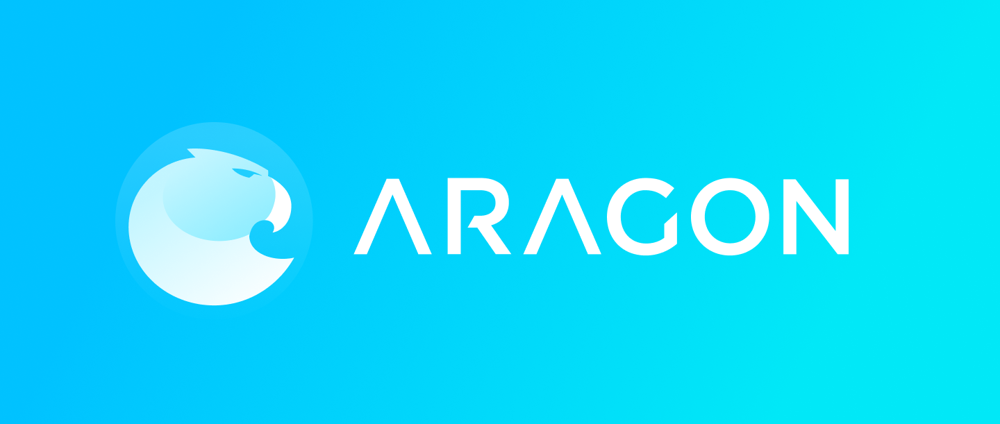

# Logo

### [Brand in Sketch format](brand.sketch)

## Imagetypes

### Horizontal
[SVG](svg/imagetype.svg) | [AI](svg/imagetype.ai) | [PNG](png/imagetype@2x.png) | [Light text SVG](svg/imagetype_light.svg) | [Light text AI](svg/imagetype_light.ai) | [Light text PNG](png/imagetype_light@2x.png) | [Dark background JPG](jpg/imagetype_dark@2x.jpg)

 

### Vertical
[PNG](png/imagetype_vertical@2x.png) | [Light text PNG](png/imagetype_vertical_light@2x.png) | [Dark background JPG](jpg/imagetype_vertical_dark@2x.jpg)

 

### Horizontal Greyscale
[SVG](svg/imagetype_horizontal_greyscale.svg) | [AI](svg/imagetype_horizontal_greyscale.ai) | [PNG](png/imagetype_horizontal_greyscale.png)

## Logotypes
### Default
[SVG](svg/logotype.svg) | [PNG](png/logotype@2x.png) | [Light version SVG](svg/logotype_light.svg) | [Light version PNG](png/logotype_light@2x.png) | [Dark background JPG](jpg/logotype_dark@2x.jpg)

 

## Isotypes
### Stroke
[Sketch](svg/aragon_stroke.sketch) | [PNG](png/stroke.png)

### Default
[SVG](svg/isotype.svg) | [PNG](png/isotype@2x.png) | [EPS](svg/aragon-logo.eps) | [AI](svg/isotype.ai)

