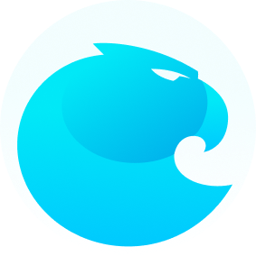

# Logos

## Aragon Project

#### [Brand in Sketch format](brand.sketch)

### Imagetypes

#### Horizontal
[SVG](svg/imagetype.svg) | [AI](svg/imagetype.ai) | [PNG](png/imagetype@2x.png) | [Light text SVG](svg/imagetype_light.svg) | [Light text AI](svg/imagetype_light.ai) | [Light text PNG](png/imagetype_light@2x.png) | [Dark background JPG](jpg/imagetype_dark@2x.jpg)

 

#### Vertical
[PNG](png/imagetype_vertical@2x.png) | [Light text PNG](png/imagetype_vertical_light@2x.png) | [Dark background JPG](jpg/imagetype_vertical_dark@2x.jpg)

 

#### Horizontal Greyscale
[SVG](svg/imagetype_horizontal_greyscale.svg) | [AI](svg/imagetype_horizontal_greyscale.ai) | [PNG](png/imagetype_horizontal_greyscale.png)

### Logotypes
#### Default
[SVG](svg/logotype.svg) | [PNG](png/logotype@2x.png) | [Light version SVG](svg/logotype_light.svg) | [Light version PNG](png/logotype_light@2x.png) | [Dark background JPG](jpg/logotype_dark@2x.jpg)

 

### Isotypes
#### Stroke
[Sketch](svg/aragon_stroke.sketch) | [PNG](png/stroke.png)

#### Default
[SVG](svg/isotype.svg) | [PNG](png/isotype@2x.png) | [EPS](svg/aragon-logo.eps) | [AI](svg/isotype.ai)

#### Blue
[SVG](svg/ant_blue.svg) | [PNG](png/ant_blue.png)

#### Black
[SVG](svg/ant_black.svg) | [PNG](png/ant_black_512x512.png)

## Aragon One Team

### Imagetypes

#### Horizontal Gradient
[Transparent background Light PNG](aragon_one/png/aragon-one-lineart-black-transparent.png) | [Dark PNG](aragon_one/png/Logo_stroke_black_long.png)

 

#### Horizontal Greyscale
[Light PNG](aragon_one/png/Logo_black_long.png) | [Dark PNG](aragon_one/png/Logo_white_long.png)  
[Transparent background Light PNG](aragon_one/png/Logo_black_long_transparent.png) | [Transparent background Dark PNG](aragon_one/png/Logo_white_long_transparent.png)

 

#### Vertical
[Gradient Light PNG](aragon_one/png/Logo_stroke_black_square.png) | [No Text Light PNG](aragon_one/png/Logo_stroke.png) |  
[Light PNG](aragon_one/png/Logo_black_square.png) | [Dark PNG](aragon_one/png/Logo_white_square.png)  
[Transparent background Light PNG](aragon_one/png/Logo_black_square_transparent.png) | [Transparent background Dark PNG](aragon_one/png/Logo_white_square_transparent.png)

 

 

### Logotypes
#### Default
[Light PNG](aragon_one/png/logo_black.png) | [Dark PNG](aragon_one/png/logo_white.png) | [Gradient PNG](aragon_one/png/logo_gradient.png)

## Aragon DAC

### Imagetypes

#### Horizontal
[Transparent background PNG](aragon_dac/logo_horizontal_transbg_small.png)  
[Transparent background PNG Mid](aragon_dac/logo_horizontal_transbg_mid.png)  
[Transparent background PNG Large](aragon_dac/logo_horizontal_transbg.png)

[PNG](aragon_dac/Logo_ad.png)  
[PNG Mid](aragon_dac/Logo_ad_1x.png)  
[PNG Large](aragon_dac/Logo_ad_3x.png)

### Logotypes
#### Default
[Transparent background PNG](aragon_dac/Letter.png) | [JPG](aragon_dac/Letter.jpg)  
[Transparent background PNG Mid](aragon_dac/Letter_1x.png) | [JPG Mid](aragon_dac/Letter_1x.jpg)  
[Transparent background PNG Large](aragon_dac/Letter_3x.png) | [JPG Large](aragon_dac/Letter_3x.jpg)

### Isotypes
#### Default
[PNG](aragon_dac/Mark_ad.png)  
[PNG Mid](aragon_dac/Mark_ad_1x.png)  
[PNG Large](aragon_dac/Mark_ad_3x.png)  

