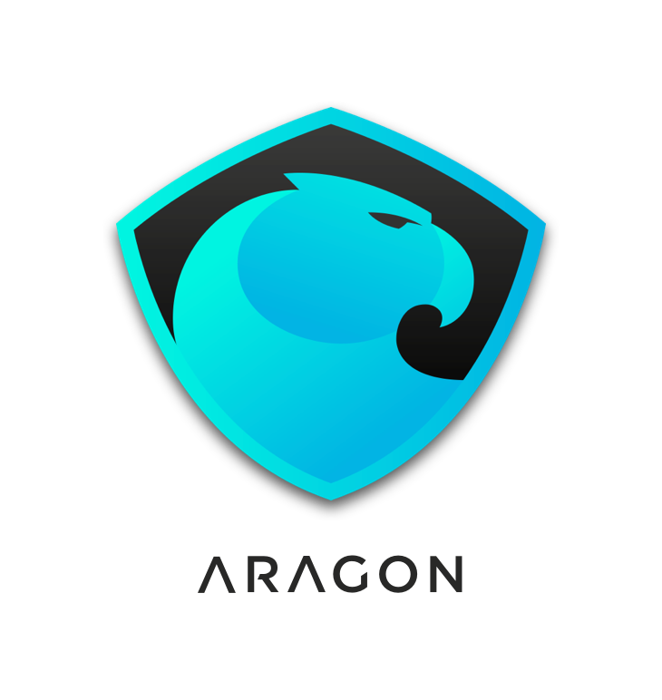
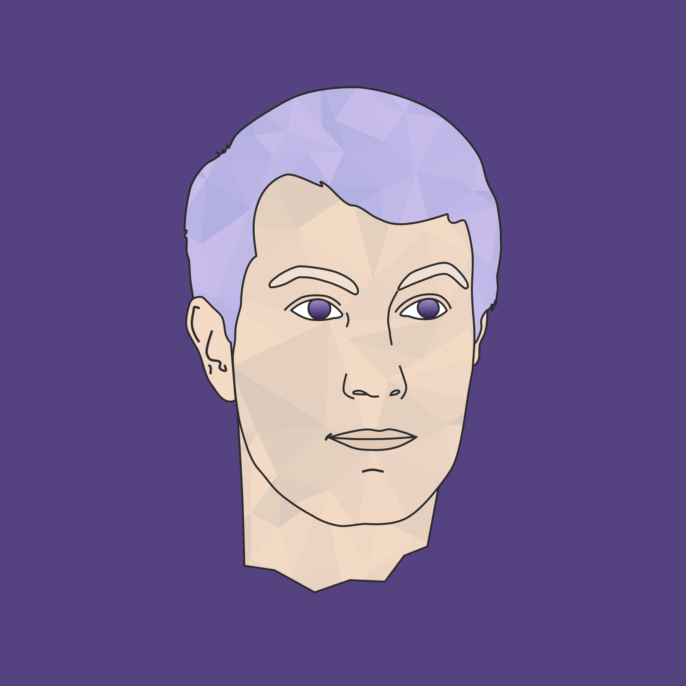
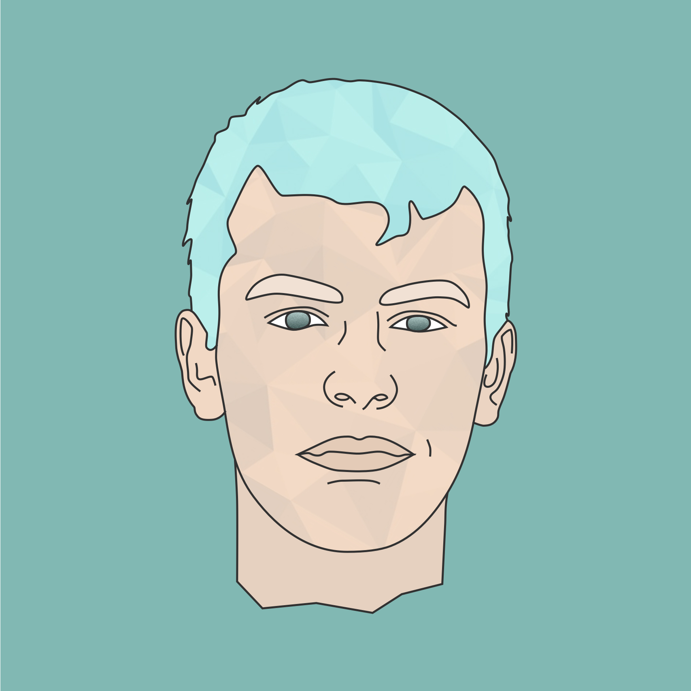
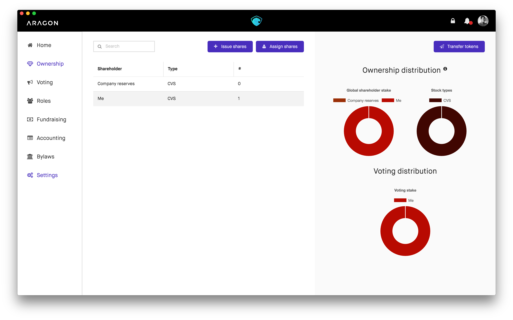
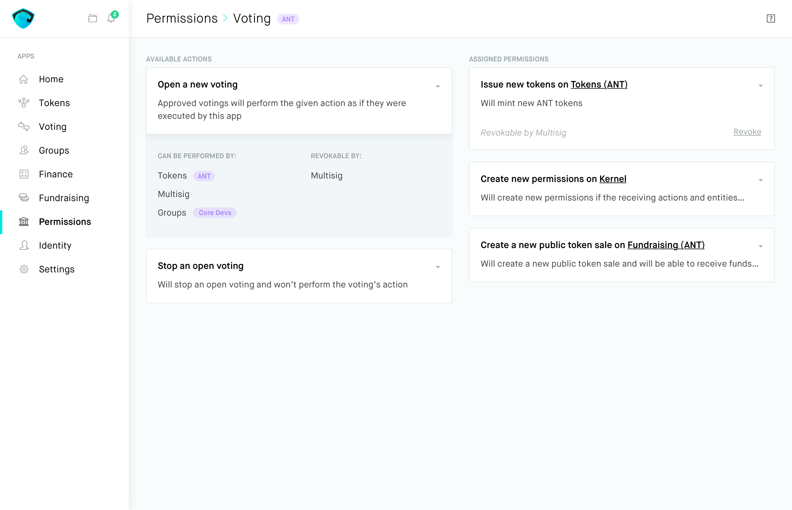
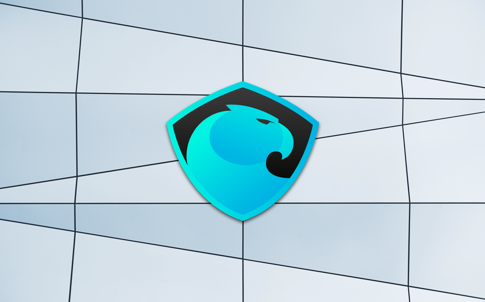

# Development Plan
_**This development plan has been deprecated in favor of the [project roadmap](https://aragon.org/project/roadmap/)._

version 1.2

## **Introduction**

Aragon is everything you need to run organizations (companies, NGOs, associations, open source projects...) on the Ethereum blockchain. It implements features like a token manager, a voting app, a finance app, a vault, and a very flexible permission system based off [aragonOS](https://aragon.one/os). Aragon organizations are easily customizable, and they are also extensible by installing third party apps.

Aragon organizations will be able to opt-in into the Aragon Network, which will provide services like a decentralized court arbitration system for them.

For more information, please refer to [our website](https://aragon.one) our dapp white paper and our [Network whitepaper](https://github.com/aragon/whitepaper).

This document describes the plans to develop the Aragon dapp and the Aragon Network.


## **History & Vision**

Luis and Jorge have been dreaming of a decentralized world for years. They met via Twitter when they were only 15 years old, and immediately started building products together.

At the age of 17, they prototyped a fully decentralized Internet replacement by using mesh networks, blockchain technology and protocols like Bluetooth LE and WiFi Direct.

[Stampery](https://stampery.com)—Luis’ latest company—made blockchain timestamping accessible, and has worked with institutions like the Estonian government, Microsoft and Telefonica. It participated in TechCrunch Disrupt and was backed by billionaire Tim Draper.

Luis has also been recognized as a [30 Under 30 by Forbes](https://www.forbes.com/30-under-30-europe-2016/technology/#6662a3e4a4b3) and [Innovator Under 35 by the MIT](http://www.innovatorsunder35.com/innovator/luis-cuende).

Before building Aragon, Luis and Jorge were in Silicon Valley working on solving the problem of patent trolls with Unpatent. After figuring out how broken the underlying infrastructure of innovation is—patent trolls thriving, Donald Trump winning the elections, bureaucracy eating entrepreneurship—they decided to focus all of their time in building the infrastructure that new companies and organizations will run on top of.


When talking about Aragon, taking a step back and thinking about the why of organizational structures like companies is a sane move.
Firms or companies exist in order to create value by using resources to create products or provide services.
However, intermediaries and third parties such as governments decrease the output of those organizations by imposing restrictions and creating complex regulatory frameworks.
Aragon was born to disintermediate the creation and maintenance of companies and other organizational structures.

Luis and Jorge were very inspired by Nobel prize Ronald Coase and his amazing paper [The Nature of the Firm](https://en.wikipedia.org/wiki/The_Nature_of_the_Firm) and Yochai Benkler's [Linux and the Nature of the Firm](http://www.benkler.org/CoasesPenguin.html). Both explore the concept of companies.

At Aragon, we believe that the blockchain and the Internet are changing the incentives for companies to exist, and we are building tools for the next generation of companies that will take advantage of these changes.

However, for decentralized organizations to be widespread, we need to make sure that they are easy to use, upgradeable/durable and able to resolve human disputes.

We want to solve—either us or partnering with others—those points in order to make decentralized organizations widespread.

And, thanks to the Aragon dapp and the Aragon Network, we can solve those points.

## **Organizational Structure**

**Aragon Community**, defining the community members contributing to the dapp and Network and the Aragon Network Token holders.

**Aragon Association**, from now on, _**the Association**_, a non-profit organization based in Switzerland, will serve as the umbrella organization responsible for allocating resources to other bodies for future cryptocurrency research and development going forward. The board of the Association consists of Luis Cuende and Jorge Izquierdo. The Association will focus on overarching the mission and will enable operating organizations to accomplish the day-to- day work.

The Association will also serve as a governance entity that will listen the Community until the Aragon Network is fully operational, from where the full governance of the Network will be transferred to the ANT holders.

**Aragon One AG**, a Swiss for-profit corporation that serves the Association and employs the first team that will work on the Aragon platform and the Aragon Network.

## **Development Milestones**

We will divide development milestones in the form of releases.
Each release may have multiple deployment stages, from being in alpha stage—running on the test network—to begin in the production stage—running on the main network—going through multiple testing, security and QA stages.

### 0.1 — The Initial Release

This the first release on macOS after months of work and weeks of privately-conducted community testing. Featured all the basic functionality that an organization needs to operate. It was not made public.
___
<h3>Release Calendar</h3>

- **Private Alpha**: February 2017
- [**Release link**](https://github.com/aragon/aragon/releases/tag/0.1)

### 0.2 — The Public Release

This was the first public release. Working in both macOS, Linux and Windows. Introduced a new UI styling and Kovan testnet support.

For more information, read [the launch post](https://blog.aragon.one/releasing-aragon-alpha-602284a5380c).
___
<h3>Release Calendar</h3>

- **Alpha**: February 2017
- [**Release link**](https://github.com/aragon/aragon/releases/tag/0.2)

### 0.3 — The Governance Release

This version added the Bring your own token functionality, that allows using Aragon with any ERC20 token as a governance token—ERC20 is a token standard allows everyone to interface with a variety of tokens in a common way. It also added two new bylaws, specific address only and ask oracle contract for confirmation—stepping stone for more dynamic bylaws.

It introduced delegate voting and creation of custom, complex stock classes.

It featured new iconography, notable startup time improvements and web browser support for using it with Ethereum browsers/clients like Mist, Parity, MetaMask, Status etc.
___
<h3>Release Calendar</h3>

- **Alpha**: April 2017
- [**Release link**](https://github.com/aragon/aragon/releases/tag/0.3)

### 0.4 — The Bridge Release
This release will focus on adding:

**Economic abstraction**

Companies will be able to hold and interact with any standard value-holding token

**Improved budgeting and accounting**

Organizations will be in itself the organization's _bank account_.

**Dividends**

Dividend sharing with shareholders, if desired.

**Fundraising tokens**

Company will be able to raise funds in the form of tokens, not necessarily ether. More flexible founding routes.

**Funds vault**

Final funds vault API, the only part of the company that is not expected to change. This will make upgradeability easier, being able to redeploy significant parts of the organization while maintaining its access to the funds.
___
<h3>Release Calendar</h3>

- **Alpha**: July 2017
- **Release link**: Deprecated due to refactor for Aragon 0.3

This will be a development version only focusing on smart contracts, iterating between different models for upgradeability, extensibility and security.





### 0.5 — The Architect Release

This release will consist of a total refactor, and will focus on adding:

**Organization-wide identity**

Entities in organizations will be able to register their own usernames in the organization, and also provide offchain metadata for displaying purposes in the UI.

**Full upgradeability**

Organizations that will be able to run as long as the Ethereum blockchain runs. No matter if big chunks of functionality are swapped.

**Totally new permission system**

Extensible permission system to allow any entity to interact with another one using an ACL (Access Control List) that the kernel controls and maintains.

**Switch to an exokernel architecture**

By making the kernel a very simple contract that just keeps the ACL and keep references to the installed apps, we can make it more secure and reduce the lines of code and complexity in apps, since there can be multiple instances of an app, also making upgradeability easier.

**Front-end apps API**

This will let developers build modules for Aragon that extend its functionality.
We will provide an API for developers to access functionality from the Aragon client, and a UI toolkit for them to adhere to our styling and UX patterns.

**Core apps API**

The API will let the developer trigger actions inside the organization itself, and access more low-level capabilities.

**Decentralized package management**

By creating the [Aragon Package Manager](https://hack.aragon.org/docs/package-management.html), which is a decentralized organization built on Aragon itself, we enable the frontend and smart contracts to be seamlessly upgraded by using any governance mechanism compatible with aragonOS.

**Human readable transactions**

Thanks to our work on [Radspec](https://hack.aragon.org/docs/human-readable-txs.html), the Aragon interface can show users a human readable description of the actions the users take on the app.

**Support for templates**

Templates allow users to bootstrap organizations with the proper permissions to replicate multiple existing models such a startup, a democracy, an open source community... with just a click.

**Survey app on mainnet**

The Survey app is an app built on Aragon that enables token holders to signal their support to different proposal. The first one is live on the mainnet now at [https://survey.aragon.org](https://survey.aragon.org).

_Blockchain projects that have already manifested interest_

___
<h3>Release Calendar</h3>

- **Alpha**: April 2018
- **Bug bounty (mainnet)**: From May 2017 to July 2018
- **Beta (mainnet)**: August 2018
- [**Release link**](https://github.com/aragon/aragon/releases/tag/0.5)

This will be the first release that gets deployed to the mainnet.
After months of public bug bounties in the mainnet, we will start allowing the first
organizations to be created using Aragon in the mainnet.

### 0.6 — The Sweet Release

This release will focus on adding:

**Permissions app**

This app will allow stakeholders to read and alter permissions on the organization, by using the modular permission system established by aragonOS.

**Identity component**

The identity component will replace all Ethereum addresses with easy to understand identity icons and names for user friendliness, and also serve to autocomplete entities while interacting with the app.

**Stability fixes**

Fix bugs and possible issues, both for users and also developers using our developer tools to create Aragon apps.

___
<h3>Release Calendar</h3>

- **Beta (mainnet)**: August 2018

### 0.7 — The Network Release

This release will focus on adding:

**Basic network-wide governance**

Which power the network will have over organizations, governance votings to decide on service providers, payouts functionality.

**App center**

The App center will allow third party apps to be installed in Aragon in order to enable different organizations to address different needs. Any aragonOS-compatible app will be able to be installed, and recommendations will be given to users.

**ANT token minting**

The network will be responsible for the minting policy of ANT, it will be decided through the governance of the network. Some of its responsibilities will be to decide the minting rate, the price and how companies pay for the subscription to the network.

**Integrate upgradeability**

Provide upgradeability as a network service for all Aragon Network organizations.
___
<h3>Release Calendar</h3>

- **Alpha**: November 2018
- **Bug bounty (mainnet)**: December 2018
- **Production deploy (mainnet)**: January 2019

### 0.8 — The Court Release

This release will focus on adding:

**Aragon Jurisdiction**

Provide a decentralized court, Aragon Jurisdiction, as network service or work with a decentralized court project to make it work with the network.

**Orgs in the AN respond to ANJ**

Organizations in the Aragon Network start being under the Aragon Jurisdiction.

**Constitution proposal**

First proposal for the basic laws that all organizations will be act under.
___
<h3>Release Calendar</h3>

- **Alpha**: Q1 2019
- **Bug bounty (mainnet)**: Q2 2019
- **Production deploy (mainnet)**: Q3 2019


### 0.9 — The Unknown Release

This is a wildcard release. The ecosystem is evolving very quickly and we don't know what interesting features we may want to add that will make the 1.0 release more appealing.

Some ideas of what we might work on here:

**Privacy-focused companies**

_**zkSnarks**_ could provide companies with way more privacy. Private voting and ownership are very interesting concepts we are researching about.

**Different governance mechanisms**

We are closely following research and experimentation on other governance mechanisms such as **Futarchy**.

### 1.0 — The Release

We expect to start marketing Aragon to the mainstream with this release. To achieve that mission, we will have to place an important focus on design and user experience.
