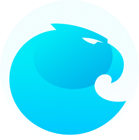
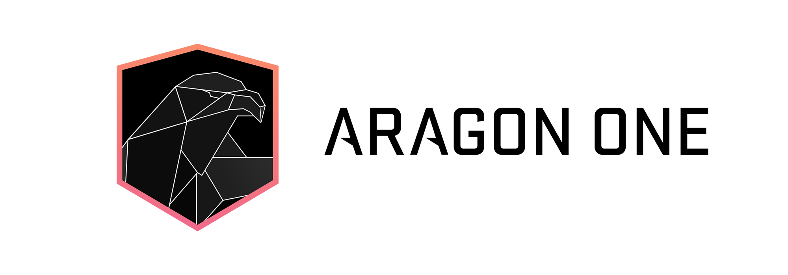
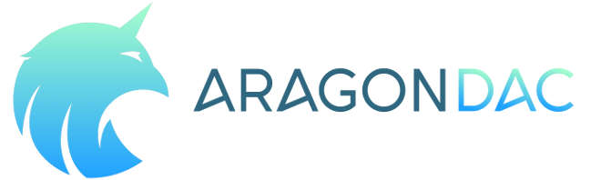

# Aragon Glossary

This page explains some of the terms commonly used within the Aragon ecosystem.

## **Aragon**

Aragon is a project to empower freedom by making decentralized governance happen.

**Website:** [https://aragon.org](https://aragon.org)

## **Aragon Network**
The Aragon Network is a a DAO that conforms a network of DAOs. It's a blockchain-native jurisdiction that supports interactions between sovereign entities by incorporating limited liability using economic incentives. It can support both human readable contracts as well as smart contracts.

**Website:** [https://aragon.org/network](https://aragon.org/network)

## **Aragon Association**
The Aragon Association is a non-profit entity that safeguards the values of the project by allocating the resources from the token sale towards funding activities and teams that move them forward.

**Website:** [https://aragon.org/project](https://aragon.org/project)

## **Aragon One**

Aragon One is a company that encompasses the foundational team working on the Aragon Project.

**Website:** [https://aragon.one](https://aragon.one)

## **Aragon DAC**

Aragon DAC is a [Decentralized Altruistic Community](https://medium.com/giveth/giveth-introduces-decentralized-altruistic-communities-dacs-d1155a79bdc4) on the Giveth platform that will work on building out core Aragon infrastructure from the end user's perspective.

**Website:** [https://giveth.io/](https://giveth.io/)

## **Aragon Chat**
A place to have discussions and to chat about all Aragon related things. A open source chat on a [Rocket Chat](https://rocket.chat/) platform.

**Website:** [https://aragon.chat](https://aragon.chat)

## **Aragon Wiki**
The home to Aragon related resources and assets such as user-related and general documentation, design items, job listings, tutorials and other related material.

**Website:** [https://wiki.aragon.org](https://wiki.aragon.org)

## **Aragon Project blog**

The Aragon Project blog can be found at [https://blog.aragon.org](https://blog.aragon.org). Contains blog posts related to the project under categories [Announcements](https://blog.aragon.org/tag/announcements/), [Product](https://blog.aragon.org/tag/product/), [Governance](https://blog.aragon.org/tag/governance/), [Research](https://blog.aragon.org/tag/research/), [Aragon Network](https://blog.aragon.org/tag/aragon-network/), [Nest](https://blog.aragon.org/tag/nest-updates/) & [Community](https://blog.aragon.org/tag/Community/).

**Website:** [https://blog.aragon.org](https://blog.aragon.org)

## **Aragon One blog**

The Aragon One blog can be found at [https://blog.aragon.one](https://blog.aragon.one). Contains blog posts from the Aragon One team.

**Website:** [https://blog.aragon.one](https://blog.aragon.one)

## **Aragon Research Forum**
A forum specifically to engage in long-form discussions related to Aragon's research efforts including governance, economics, and token engineering.

**Website:** [https://forum.aragon.org/](https://forum.aragon.org/)

## **Aragon Developer Portal**
Home to developer documentation, guides & tutorials on the infrastructure and tools built by Aragon.

**Website:** [https://hack.aragon.org](https://hack.aragon.org)

## **Aragon / Aragon client**
Aragon client is a tool for all of humanity to organize. It's an open source decentralized application that let's you create, run and manage your organization freely. Decentralized organizations created on the Aragon platform are unstoppable in nature thanks to the [Ethereum](https://ethereum.org) blockchain.

**Website:** [https://mainnet.aragon.org](https://mainnet.aragon.org)

## **Developer glossary**
For developer tools and frameworks like aragonOS or aragonCLI, you can check out the [developer glossary](https://hack.aragon.org/docs/glossary.html).
