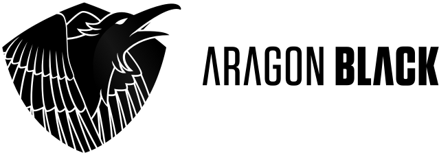

# Aragon Flock proposal: Aragon Black 

## Summary

**Aragon Black** is a team whose core members come majoritarily from the **Pando Network** team [mostly known in the ecosystem for the development of the pando protocol]. The Pando Network team has been working closely with the Aragon ecosystem for almost a year now and has been the recipient of two Aragon Nest grants: [[1][28] & [2][29]].

To strengthen its commitment to the Aragon movement, the Pando Network team has decided to **apply to the Flock program as Aragon Black**. This first Flock proposal covers six months of work. However, if the Aragon community lends us its trust, we intend to re-apply to this program on the long run.

Our long term vision is to **turn Aragon into the go-to choice to decentralize the governance of open-source projects and common goods**. Thus, our work will focus on a. providing the tools to experiment with new economic dynamics [[I01]](#i01---fundraising) ; b. providing the tools to maintain open-source projects over Aragon [[I02]](#i02---aragonpm) [[I03]](#i03---aragon-development-infrastructure) ; c. improve some core components of the Aragon stack [[I04]](#i04---generics--aragon-stack) and ; d. on-board non-tech-savvy people and real common-driven projects into the Aragon Ecosystem [[I05]](#i05---generics--aragon-community--ecosystem).

To cover its operating costs for six months [Q3 & Q4 2019] and contribute creating a thriving Aragon ecosystem, Aragon Black requests:

- \$450k paid in DAI [or any other stable assets].
- 125k ANT for incentivization purposes.

**Note.** AGP quarterly votes happen at the end of each quarter. Thus, even if this Flock proposal intends to be submitted to the Q2 2019 AGP vote, its funds would [hopefully] cover our operating costs for Q3 & Q4 2019. If this proposal makes it through the ballot, we intend to re-submit a longer proposal at the Q4 2019 AGP vote.

**Note.** This proposal introduces the short-term outputs we intend to deliver by the end of 2019. Besides these immediates deliverables, we are also working on providing long-term sustainability to the Aragon ecosystem. As the leads to achieve this sustainability are still under heavy discussion within the community, we won't discuss their details in this proposal. For a deeper view, these leads are synthesized in a forum post [here](https://forum.aragon.org/t/aragon-flock-proposal-aragon-black/646/19).

## Deliverables

We are splitting deliverables across the following initiatives:

### I01 - Fundraising

The goal of this topic is to provide a library and a standalone dApp any Aragon DAO can use to raise funds through a Continuous Funding scheme.

#### 2019 deliverables

**Fundraising library.** Develop a modular fundraising library providing low-level building-blocks: curves, taxation mechanisms, withdrawal mechanisms, etc.

**Fundraising app.** Develop an opinionated but ready-to-use fundraising app - based on the previous library - implementing the [Apiary][4] scheme designed by [@lkngtn][5].

#### Longer-term deliverables

**Fee and signaling.** Design and discuss a token economics model for Apiary, relying on buy / sell orders fee and an ANT-based staking mechanism for DAO signaling.

**Discovery platform.** Develop an Aragon Network wide fundraising platform allowing Aragon users to discover and join new DAOs.

#### Resources

A PoC of such a fundraising app is already available [here][6] and demoed [here][7].

### I02 - aragonPM

The goal of this initiative is to enhance aragonPM to the point where it become a serious - and backward compatible - alternative to NPM.

#### 2019 deliverables

**Frontend.** Develop a dApp allowing to easily search and browse through aragonPM registries and repos [an aragonPM equivalent to [npmjs.com][3]].

**NPM compatibility.** Develop an enhanced version of aragonPM-serve complying with the NPM Registry API to enforce aragonPM - NPM compatibility.

#### Longer-term deliverables

**Linking fee and insurance**. Design and discuss an ANT-based token economics model for aragonPM registries, relying on linking fees and an insurance system.

**pando | aragonPM.** Develop a common contribution and dependency tracking system shared by aragonPM and pando to serve as the foundation of a possible token-economic model for aragonPM repos.

### I03 - Aragon Development Infrastructure

The goal of this initiative is to drive Aragon's development to a higher degree of decentralization thanks to pando [a decentralized VCS our team as been working on for the last past year thanks to the Nest program].

#### 2019 deliverables

**Pando.** Keep on developing and enhancing the pando protocol and all related DAO templates for mainnet launch.

**Experimentation.** Experiment using pando to host non-sensitive Aragon repositories: documentation, Aragon Monthly, etc.

#### Longer-term deliverables

**Contribution economics.** Work closely with all the other Aragon teams to design [and experiment with] possible reward systems for Aragon contributors.

**GitHub drop-out.** Support Aragon teams in experimenting with pando to gradually migrate Aragon codebase to a fully decentralized infrastructure.

**PandoHub / AragonHub.** Ship everything we have learned in this initiative into a ready-to-use decentralized alternative to GitHub.

**Custom Open Source licence.** Deliver of a fork of the [Contributive Commons Licence][1] in order to implement an isomorphism between DAOs governance rules - as defined through blockchain-based smart contracts - and nation-states juridical frameworks.

#### Resources

You can have a quick overview of Pando by watching the talk we gave at [AraCon][2] and try our Rinkeby app by reading our [announcement](https://forum.aragon.org/t/pando-live-on-rinkeby/712) and watching our [demo/tutorial](https://vimeo.com/328713388).

### I04 - Generics | Aragon Stack

The Aragon Black team is committed to help improving the existing Aragon stack in every aspect it entails with a particular focus on the following topics.

**Monolithic app.** Work closely with all the other Aragon team to allow Aragon apps to handle multiple contracts.

**CLI apps.** Enhance the aragonCLI to potentially serve as a foundational layer for aragon-related node / CLI apps.

#### Resources

Work as already been undertaken in collaboration with the Aragon Mesh team regarding the extensibility of the aragon CLI. More informations are available in this forum [post](https://forum.aragon.org/t/aragoncli-extensibility/680).

### I05 - Generics | Aragon Community / Ecosystem

The Aragon Black team is committed to help extend the existing Aragon community / ecosystem and spread the philosophy of Aragon's [manifesto][8] in every aspect it entails with a particular focus on the following topics.

#### 2019 deliverables

**On-boarding.** Help on-board common-driven organizations [political organizations, artistic organizations, cooperatives, etc.] into the Aragon ecosystem to develop real-world use cases.

**Interviews / theorization.** Manage interviews with and publications from « outsiders » of our crypto-ecosystem: political activists, philosophers, etc. Aragon Black has a long experience in the publishing / journalism field. We thus intend to launch a dedicated blog to drive dialogues and theorization experimentations around the DAO / crypto landscape.

**Book.** Publish, at the end of this year, a book compiling these articles [under a CC licence] to offer the Aragon ecosystem more visibility outside of the crypto-space.

#### Longer-term deliverables

**Aragon / pando based publishing platform.** Develop a Medium-like dApp based on Aragon / pando allowing to « thank » and reward authors, proofreaders, etc. through an Aragon DAO linked token.

## Grant size

We would like to request **\$450k** paid in DAI to cover the operating costs of Q3 & Q4 2019. These funds would be used as follow.

### Estimated operating costs for Q2 and Q3 2019

| Type        |              Description               | Amount |
| ----------- | :------------------------------------: | -----: |
| Payroll     |                                        | \$410k |
| Contractors |   DevOps \| Design \| Legal \| etc.    |  \$10k |
| Services    | GitHub \| Google Suite \| Chat \| etc. |   \$5k |
| Travel      |    Offsites \| Conferences \| etc.     |  \$10k |
| Equipment   |             Laptop \| etc.             |  \$15k |
| **Total**   |                                        | \$450k |

### ANT package

We would like to request **25k ANT per team member per year** for incentivization purpose, i.e. **125k ANT** for this six months long proposal. We are committed to the Aragon Network in the long-term and therefore accept a 4-years vesting schedule.

## Team

The team will be comprised of **10 people** distributed as follow. This team is partly remote and distributed across Europe. We will thus hold quarterly offsites to gather together.

### Development

#### Olivier

Tech lead @ Aragon Black \| Co-founder @ Pando Network \| Co-founder @ DistributedGallery

Olivier has a Master degree in Computer Sciences from Centrale/Supélec. After graduatıng he worked on various open source projects before completing a Ph.D ın philosophy. In 2015, he defended his Ph.D thesis in Communication Sciences on web-based decentralized organizations. He then worked as a Professor at University Rennes 2 for three years discussing the economical, sociological and philosophical implications of distributed organizations and blockchain technologies. He has now resigned from academıa to work full time on the blockchain projects he leads.

GitHub: [@osarrouy][9]

Twitter: [@osarrouy][10]

#### Xavier

UI / UX @ Aragon Black

Xavier is a JavaScript expert and freelance creative technologist based in Nantes, France. His main focus is on interactive experiences, be they with web technologies or electronics, often both. Obsessed with JavaScript: React, Vue.js and Node, he is an outstanding designer when it comes to electronics and always has an Arduino or a Teensy next to him to build real life interactions. Active member of the POW collective and founder of it's company named Drangies, his work has been presented in many exhibitions, events and live shows. Xavier has started working with blockchain technologies and web3 a year ago and is one of the maker of the [Chaos Machine](http://distributedgallery.com/Chaos.html).

GitHub: [@xseignard][11]

Twitter: [@xavier_seignard][12]

#### Deam

Frontend @ Aragon Black

Deam has been a web developer for nearly 4 years, and is mostly self-taught through open source work. Previously he worked for a small Danish startup, Peergrade, as a Full-stack developer. He started out in the crypto space by contributing to Giveth and has been in the community for a year now. He has since contributed to projects such as, Giveth Dapp, Giveth Riot Bot, Giveth Wall of Fame, Tennagraph, That Planning Suite and Aragon UI.

GitHub: [@deamme][13]

Twitter: [@deamlabs][14]

#### Cory

Web 3 @ Aragon Black

Cory is a software engineer and aspiring mathematician with a background in neural networks, looking to bring the Semantic Web practices into smart contract development. He is Research focused around the relationships between lie groups, non-linear stochastic processes, and control theory.

GitHub: [@gh1dra][15]

#### Billy [contractor]

Curve Bonding @ Aragon Black \| Co-founder @ Bin Studio

Billy is an artist, developer and co-founder of Bin Studio, a multidisciplinary research, design and development studio based in Berlin, DE. In 2018 he received an ECF grant to continue work on Clovers.Network, a game that rewards the creation of scarce art. He’s the author of EIP-1633 (Re-Fungible Token) and active contributor to the Curation Market Community. He’s involved as a developer, researcher and community member of a number of projects including Cosmos.Network, Gnosis.io, Relevant.community, NewModels.io, Trust.support, MemeLords.com, ENSnifty.com and Doneth.org.

GitHub: [@okwme][16]

Twitter: [@billyrennekamp][17]

### Strategy Lead

#### Cem

Co-founder @ DAOincubator

With a background in institutional Investment Banking, Cem has worked on establishing and raising for EM ETFs. He won a Financial Innovation award in 2013 for designing a borderless credit system. After working on startup financing advisory, Cem co-founded Horatii Partners, a research/advisory agency focused on distributed governance. Cem is also a co-founder of “DAOincubator”, an ecosystem catalyst which aims to aggregate research, funding, and design which targets the betterment and implementation of DAO based initiatives. Cem is a competitive sailor since age 9 and writes about art philosophy and critique for a Turkish lifestyle magazine.

LinkedIn: [@cemfdagdelen][30]

Twitter: [@CemFDagdelen][18]

Medium:[@CemFDagdelen][19]

### Strategy & Partnerships

#### Alexandre

Co-founder @ Pando Network \| Co-founder @ DistributedGallery

Co-founder of Pando, Alexandre was a research engineer and Ph.d student at university Rennes 2 where he studied the contemporary forms of our digital co-presences. Alexandre was a professor of communication sciences between Rennes and Paris for 4 years before leaving its teaching and research activities to fully devote itself to the possibilities opened up by blockchain technologies. Beside his work on the Decentralized Licence, he initiates partnerships to create labs that will soon be experimenting on Aragon.

Twitter: [@alexandreroxel][20]

Medium: [@alex_71247][21]

### Research & Community

#### Daniel

Daniel is a governance researcher focused on the topics of protocolar governance, legal and taxonomical classification of DAOs, as well as open-science with the Abstract Machine project for Pando (immutable, uncensorable and self-governed journals). Daniel has a degree in economics from Bocconi University with a thesis on the perverse monetary, economic and political effects of natural resource booms. In a previous life he worked as a payments consultant advising entities such as Atos Worldline, Paypal, Mastercard, Unicredit and the Italian Banking Association on their clearing and settlement and dispute systems. DJs in his spare time.

LinkedIn: [@danielshavit][31]

Twitter: [@cryptodani][22]

Medium: [@danielshavit][23]

### Editorial Manager & Coordination

#### Nolwenn [part-time]

Co-founder @ Pando Network \| Co-founder @ DistributedGallery

Co-founder of Pando, Nolwenn has a first masters degree in History & Criticism of arts and a second in Publishing & Creative Economy. She worked several years in cultural management, visual art galleries and various festivals as team coordinator and executive assistant. As a result, she is experienced in professional cultural worlds. Beside her coordination/organisation role, she has been a small format editor for the past two years and writes fiction in her free time.

Twitter: [@nunjollivet][24]

Medium: [@nnjollivet][25]

### Chief Redactor & Communication

#### Thibault [half-time]

Co-founder @ Pando Network

Co-founder of Pando Network, Thibault has been journalist for two years, book reviewer and qualified in modern literature and publishing. Thibault is also a writer in his free time. After some time as a Ph.D student in Canada where he studied literature he came back to join the Pando team. He’s interested in discourses about the end of literature and particularly the possibilities of renewal of the contemporary literary field.

Twitter: [@Tboixiere][26]

Medium: [@Tboixiere][27]

## Requirements

Blog access on blog.aragon.org

Repo access on the entire @aragon organization

Unrestricted use of the Aragon trademark

Publish access to aragonpm.eth

Access to Aragon servers and cloud infrastructure

Access to Aragon DNS and ENS domains

Admin/moderator access on aragon.chat and forum.aragon.org

## Organization structure

Aragon DAO. A company / non-profit incorporated in the UE will be registered later.

[1]: http://contributivecommons.org/licence-contributive-commons-by-co-sa-1-complete/
[2]: https://youtu.be/dMcpubfIG-k?t=11145
[3]: https://www.npmjs.com/
[4]: https://github.com/1Hive/Apiary
[5]: https://twitter.com/lkngtn?lang=en
[6]: https://github.com/pandonetwork/apiary
[7]: https://www.youtube.com/watch?v=NDyHxzzxtBw
[8]: https://blog.aragon.org/the-aragon-manifesto-4a21212eac03/
[9]: https://github.com/osarrouy
[10]: https://twitter.com/osarrouy
[11]: https://github.com/xseignard
[12]: https://twitter.com/xavier_seignard
[13]: https://github.com/deamme
[14]: https://twitter.com/deamlabs
[15]: https://github.com/gh1dra
[16]: https://github.com/okwme
[17]: https://twitter.com/billyrennekamp
[18]: https://twitter.com/CemFDagdelen
[19]: https://medium.com/@CemFDagdelen
[20]: https://twitter.com/alexandreroxel
[21]: https://medium.com/@alex_71247
[22]: https://twitter.com/cryptodani
[23]: https://medium.com/@danielshavit
[24]: https://twitter.com/nunjollivet
[25]: https://medium.com/@nnjollivet
[26]: https://twitter.com/tboixiere
[27]: https://medium.com/@Tboixiere
[28]: https://github.com/aragon/nest/pull/31
[29]: https://github.com/aragon/nest/pull/120
[30]: https://www.linkedin.com/in/cemfdagdelen/
[31]: https://www.linkedin.com/in/danielshavit/
