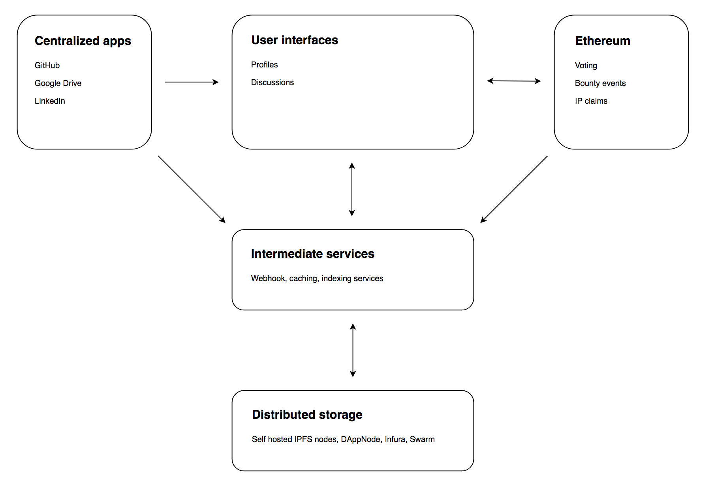
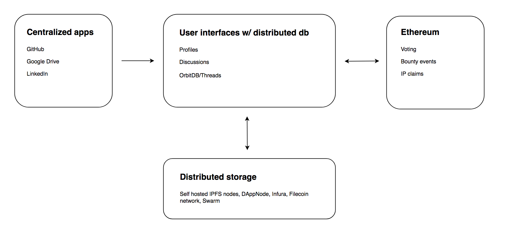

# Summary
Autark is a new organization that is to be established for the purpose of advancing life on Earth, with a special focus on DAOs, Aragon, worker-autonomy, and ***access to tools*** that support the global development of complex mega-projects.

To us, complex mega-projects can mean autonomous cities, next-generation transportation systems, solving sustainable development goals, redesigning the United Nations, or even building spaceships. There are common tools needed that will meet the primary coordination use case across all of these sectors: this can be evidenced by enterprise software companies such as Oracle and SAP building generic systems that are adopted across industries.

We will be calling this Aragon suite of project and human-coordination tools Open Enterprise, as DAOs that are solving mega-projects are the definition of an open enterprise. 

In building Open Enterprise, we plan to also work as consultants for other decentralized organizations that intend to become (or currently are) DAOs to build custom implementations, and also determine common requirements, so we can drive the suite toward meeting the 80% use case.

The Open Enterprise roadmap will be a continuation of the Planning Suite, with an additional focus of assessing the existing Aragon App ecosystem as a whole to develop common design patterns and components for the optimal cross-application user experience. This may require special application forks, and moving features from one app to another.

**Privacy**, **internationalization**, and **accessibility** are three important pillars of our organization, and will be the pillars in which we plan to uphold the Aragon Manifesto. The Manifesto states "**we are committed to a world in which _every person_ can participate in these new organizational structures"**. We interpret this to mean that we need to ensure these tools can indeed be used by **everyone**. 

Hence, Open Enterprise will:
- Support communities that need to coordinate collective action in a more private manner. For this use case, we need to research the best technological architecture that can support censorship-resistant private projects.
- Be usable by all languages that want to adopt the tools. This means the front-end framework should support right-to-left languages. In addition to modifying the front-end to support this mode, it will also entail driving Aragon App standards to move away from hard-coded display text, and instead toward strings that reference distributed storage layers. These strings can be collectively translated to create new language packs that meet the demands of the network.
- Meet accessibility standards. Accessibility is the design of products, devices, services, or environments for people with disabilities. Hence we should modify Aragon architecture to support various accessibility modes.

While these specific features are not on our immediate roadmap, they will be targets we strive towards as an organization. We see the adoption of Aragon and Open Enterprise as a way of expediting the future of work and society; one tailored around worker-autonomy, solidarity, reclaiming freedom, reclaiming land, and ultimately the stewardship for Planet Earth and all of its citizens. 

# Deliverables
First, we need to build common building blocks for the Aragon ecosystem that makes collaboration and coordination more seamless. We are splitting deliverables across initiatives, which are grouped by topic.
## I01 - Cross-Application User Experience
### aragonAPI

A major limitation of the Aragon architecture is the tight coupling between an individual application front-end and contract. With this limitation, there is less freedom to design feature sets with the optimal user experience, where multiple contracts may be more logical for a single application.

To improve upon the architecture, aragonAPI will be modified so as to support both relationships between a single app front-end and multiple contracts, as well as add tools to allow for contract data to be displayed across multiple user interfaces without coupling at the contract level. 

Once the flow has been defined within aragonAPI we will create at least one example of how we see ideal one-to-many and many-to-one relationships working.
### Expanded Forwarder Options
Currently the forwarder is mainly designed to pass isolated actions where the forwarder has little to no knowledge of the forwarded action. We will research potential ways to expand its usability by creating additional specifications for script execution. This will allow for more tightly coupled forwarder interactions where the forwarded call data can actually be leveraged and modified within the Forwarder contract.

At minimum we will design the specification and implement it in aragonOS for forwarder interactions that expect data to be passed between the forwarding and forwarder contracts at the contract level.

## I02 - Contextual Discussions
Many applications throughout Aragon would benefit from contextual discussions or commenting. For example, if there is a transaction displayed in the Finance app, a member of the organization may be interested in beginning a discussion related to a transaction in the table. Additionally, Votes, Surveys, and Range Votes will all benefit from having the discussion located within Aragon.

At the high level, discussion capabilities will have:
- Ability to add, edit and delete comments
- Support for markdown
- Ability to like comments, weighted by the amount of DAO’s tokens held at time of snapshot based on context 

We will ensure that the work we do in enhancing aragonAPI will enable us to support this use case, and will deliver at least one fork of an existing app that has integrated discussions.

## I03 - Rich User Profiles
While Aragon One’s identity app will provide much-needed features; an identity is more than a name, bio, ENS domain, and avatar. We propose to expand identities to allow for more rich profiles. This will be useful as the network of organizations within Aragon grows and a freelancer culture develops. This supplementary data can be useful in assessing allegiances, expertise, and clout.

The additional data elements that will be relevant to expose in relation to a profile can be:
- Memberships to other Aragon DAOs
- Work Experience
  - Ability to import data from LinkedIn or manually input work experience
  - Ability to import commit history from Github, highlighting top projects
  - Ability to curate an portfolio of images (such as design work) hosted on distributed storage

While we are aware [3box](https://3box.io/) is developing “Ethereum Profiles” which may cover aspects of this initiative, we will perform an assessment to see if it makes sense to leverage their framework before going all in on a fully custom implementation.

## I04 - Expanding Governance Possibilities
### Reputation System
Implementing a reputation system within Aragon will expand governance possibilities and allow the usage of Aragon for reputation-based governance without requiring the integration of external applications such as Colony or DAOstack which can add security risks.

The most logical place to implement the reputation system will be within the Projects application. To support reputation, changes to the Token Manager will be required, to allow minting a special type of quasi-transferable tokens that can be transferred only by a whitelist of addresses (e.g. the Standard Bounties contract or a specific Aragon application). Additionally, the Projects app will have to be enhanced to allow multiple tokens to be allocated to bounties.

The end goal is that when a user completes a task using the Projects app, they can collect a variety of tokens -- standard ERC-20s in addition to non-transferable reputation tokens.

### DAO Templates
At the moment, there are only two templates: Multisig and Democracy. To expand governance possibilities and allow for an easier user experience when a new DAO is being deployed, it will be beneficial to develop additional templates for the ecosystem. 
As part of this initiative we aim to create one additional template that will support reputation-based organizations. 

## I05 - Data Storage and Standards
Discussion forums, rich user profiles, and other familiar collaboration features are unique because they rely on data that is not efficiently stored on Ethereum. Our long term goal is to support these features with completely distributed storage while maintaining capabilities like optimal querying and dynamic access control. We’ll start with a “web 2.5” storage solution, learn more about users while relevant technologies mature, and remove intermediate services over time.

DAOs should be able to store their data with these qualities:

*Accessible* — all data from discussions and features alike will be available in distributed storage. This allows anyone to view and backup work without hitting a centralized server.

*Standardized* — by content addressing data and following open data standards, we can make people’s work more compatible across DAOs and other open source projects.

*Timestamped* — contributors should be able to create snapshots of their work across platforms. One way to do this is to store data on IPFS and write the hash to Ethereum.

### Short Term 
**Next 6 months** - Immediate support for discussions and profiles

A near term storage solution preserves important qualities of decentralization without jeopardizing technical feasibility or user experience. It has a distributed data layer (i.e. IPFS) with intermediate services running on top of it. These services should be open source and provide clients efficient read/write capabilities to/from distributed storage.

Our initial architecture will likely have a distributed data store with intermediate services on top for caching, indexing, and writing to distributed storage. Although clients can always fetch data directly from distributed storage, our intermediate services will give enhanced access to it. 

We’ll also be exploring how events relating to DAOs from centralized apps and Ethereum could be captured and displayed within Aragon apps. Some example events could include GitHub commits, issue comments, external forum discussion, etc. 

Over time we can replace intermediate services with their distributed counterparts such as OrbitDB, BigChainDB, Threads, Solid and others. Part of our goal over the next six months will be to better understand the feasibility of using these technologies.

### Long Term
**12 - 24 months** - Iterating and upgrading to “web 3.0”

While intermediate services still will be useful in the near-term, they should become less necessary as we implement distributed databases. At this point we will have new information about the community and their needs. If the demand for removing all centralization is high, a reliable distributed storage solution is feasible in this timeframe. Conversely, if we find the community cares more about new features we will be well positioned to extend our short term strategy and build more services.

We understand that some things move quickly in this space while others take longer than expected so we are purposefully keeping our long term plans flexible.

(Note: The images above are our initial architecture sketches. We’ll continue to refine these, especially during the first month of work.) 

## I06 - DAO Identity
Organizations and entities have unique brands, which help them differentiate from one another and convey a fine-tuned message. One value add for the Aragon platform will be to provide features that allows an Organization to showcase their unique identity. At the moment, Organization avatars are the only way to differentiate. With the DAO Identity initiative, this will be expanded by allowing a DAO to tailor the branding and theme of the Aragon platform and also providing a user guide for self-hosted domains. To kickstart this, we will:
- Design at least three additional themes (including dark mode) and enhance the Organization Settings to support switching between themes 
- Enhance the Organization Settings to support changing the background image (at the moment it’s an Eagle)
- Develop a simple read-only “About” Aragon App where the DAO can input and display their manifesto, mission statement, values, code of conduct, contact information
- Write a user guide for hack.aragon.org that describes how to deploy Aragon to a self-hosted domain

Eventually, the long-term goal for this initiative is to move toward a “Wordpress for DAOs” experience, with a rich library of themes and many ways to easily customize layouts. To support this ultimate vision, we will begin research to assess any architectural changes required.

## I07 - Rewards Application and Planning Suite
This Flock proposal includes team members that were awarded a Nest grant for a Planning Suite, which contains five applications: Allocations, Range Voting, Address Book, Projects, Rewards. 

The plan is to finish Milestone 3 by the end of January, before the Flock funding would begin. This Flock proposal includes rolling up Milestone 4 and 5 into Flock which entails the Rewards app, and any final “clean up” to get the Planning Suite into a stage to launch. Since we are rolling up Milestone 4 and 5 into this proposal, that means that we will not get paid those additional milestones which value to $40,000. Instead, the team will be paid via Flock payroll.

Since the completion of the Planning Suite overlaps with the timeline of this Flock proposal, we think it makes sense to roll up the remaining work as it will be delivered more expediently with more full-time team members. 

# Grant Size
## Estimated operating costs for Q1-Q2 2019
We would like to request $390,000 paid in DAI to cover 26 weeks of operating costs (February 3rd to August 3rd 2019).

- Autark payroll for 6 full-timers (includes healthcare stipend) - $295,000
- Open Work Labs partnership (40 hrs/wk- details in team section) - $60,000
- Contractors (Accounting, Graphic Design, etc) - $10,000
- Misc. (Equipment, SaaS software/hosting, co-working space memberships, contingency) - $10,000
- Team Offsite (One total) - $15,000

If we underspend for the Contractors, Misc., and Off-site categories, the budget will be rolled over to the subsequent grant period or returned to Aragon if we do not get approved for a subsequent grant. We will transparently document expenses.

## ANT package

We would like to request an additional 350,000 ANT to incentivize the 6 full-time Autark members funded by this proposal, distributed over 4 years of work. This ANT will have a 1-year cliff and 4-year vesting. Any additional ANT we request in the future will be for new team members. 

## Organization Structure

Autark will initially be a remote team of independent contractors, but assuming we prove ourselves to the Aragon Network, we plan to eventually build a local team in Berlin to complement the remote team. Berlin is becoming one of the largest crypto hubs in the world, with a strong community passionate about decentralized organizations.

# Team
## Autark
The Autark team will be comprised of 6 full-timers and will initially be fully remote and distributed across the world, primarily in Europe and America. 

#### Yalda Mousavinia - Management, Product, UX, Community

Yalda has 10 years of experience in product management and UI/UX design. For over 2 years, she has been researching and designing system architectures that relate to open source ecosystems and using incentives to promote growth. This work lead her into the concept of DAOs and the founding of Space Decentral, a decentralized autonomous space agency. She continued this work as the Project Lead of the Planning Suite Nest grant. Prior to Space Decentral, she worked as a Senior Product Manager at Oracle for 2.5 years, on their Enterprise Resource Planning software suite. She has a Bachelor of Science in Mechanical Engineering from UC Berkeley and Astronautical Engineering Certificate from UCLA.

[Twitter: stellarmagnet](https://twitter.com/stellarmagnet?lang=en), [Github: stellarmagnet](https://github.com/stellarmagnet)

#### Arthur - Technical Lead

Arthur is the technical lead of the Planning Suite nest grant. He has direct experience with governance expirements through his work with Giveth, and has participated in multiple high profile Ethereum audits including the WHG audit of AragonOS and MakerDAO. He graduated with a Bachelor of Science in Computer Science from Rochester Institute of Technology. Professional full stack developer for 2 years and a smart contract developer for 1 year.

[Github: Quazia](https://github.com/Quazia)

#### Kevin Siegler - Solidity/Web3 

After fostering an enduring fascination with Skunk Works, Kevin obtained a B.S. and M.S. in Mechanical Engineering from Northwestern University with a focus in robotics, and worked 3 years in the aerospace industry as a mechatronics engineer. During that time he was a member of Cobham’s Leadership Development Program. Over the past two years he has been pursuing his dream of scaling the field of aerospace globally as a co-founder of Space Decentral and helping to bring the vision of a decentralized space agency to life. Most recently he has been a solidity developer with the Planning Suite nest grant.

[Github: topocount](https://github.com/topocount)

#### Radek Zasiadczuk - Full Stack

Radek is a full stack developer for the Planning Suite Nest grant and Space Decentral. He has also been working as a Senior System Administrator and DevOps Engineer at Oracle for 13 years, where he builds and maintains Data Centres around the world. For the last few years with increasing fascination, he has researched augmenting human collaboration with software, starting with simple project management systems to emerging DAO-style endeavours, operating on non-linear and non-hierarchical principles.

[Github: rkzel](https://github.com/rkzel)

#### Otto Garcia - Full Stack

Otto is currently a full stack and react developer with the Planning Suite nest grant team. He is a multidisciplinary self-taught developer and open source lover. He has been focused in the crypto space since 2013, involved into several altcoin community projects and blockchain startups in different fields, from mining pools to PoW algorithms, and lately doing Ethereum and dApps research, blockchain technical education programs, and managing several successful crypto communities in Spain. 

[Github: ottodevs](https://github.com/ottodevs)

#### We will have a job opening for one new hire
We will have an open position for an additional full-time web3 developer and are including this in our budget, but the budget can be allocated to us after we secure the developer.

We want this flexibility to add one additional resource especially if that resource will be needed to deliver on our proposal. We have learned from our Nest experience that estimating roadmaps are challenging, especially when working on a very early dapp framework with many moving parts. Hence having the financial leeway to take action and adapt is important.

Based on if and when we onboard this resource, it may affect our scope. We plan to revisit the scope at a 13 week check-in point.

We do not plan on dedicating that much time to recruitment beyond following up on inbound leads and mentioning the open role at the bottom of our blog posts, unless it becomes highly critical that the resource is needed to fully deliver on our proposal. 

### Technical hiring process
After an initial interview with the candidate to make sure they mesh well with our team and have aligned values, we will open up the second stage which tests their technical skills. This will require the candidate successfully develop one aspect of our roadmap, in a bounty-like manner. [Please refer to this example](https://docs.google.com/document/d/1foZm4Gpru2SU1fi_90_w7AaVJaji02Yr_85zPPn1jss/edit#), although this may not be the specific bounty we publicize inititially. The way it would work is that if we merge their pull request for the bounty, they will get rewarded for their contribution in addition to a job offer.

### Partner Organization
In addition to the Autark team, we are establishing a relationship with a partner organization, Open Work Labs. Three engineers from **Open Work Labs** will work on a contract basis and we have budgeted for a maximum of 40 hours a week (1 FT equivalent) of software development, devops, and technical direction for the Data and Storage Standards initiative which bleeds into other initiatives such as Contextual Discussions and Rich Profiles. Two of them are also ConsenSys engineers with experience developing and implementing such solutions.

This expertise will round out the skills of the Autark team, ensuring that we lay a solid foundation for our deliverables. They are committed to building a long lasting relationship with Autark and Aragon in the case of continued Flock funding.

#### Jonathan Schwartz
Jonathan is a frontend and web3.js developer at ConsenSys (Ujo Music) where he works with open data standards and synchronizing data across multiple providers. He has taught full stack JavaScript and created a blockchain course for Fullstack Academy of Code. Jonathan graduated with a bachelor’s in finance and co-founded an identity management startup while studying at the University of Wisconsin.

Socials: [Github](https://github.com/Schwartz10) - [LinkedIn](https://www.linkedin.com/in/schwartzz8990)

#### Thomas O’Brien
Thomas is a backend software developer at ConsenSys (Ujo Music) and focuses on data standards and distributed storage. Before ConsenSys he got a bachelor’s degree in political science, started a crowdsourced skate brand, and worked as a JavaScript developer for three years.

Socials: [Github](https://github.com/thomasbeta) - [LinkedIn](https://www.linkedin.com/in/thomasbeta/)

#### Peter Andersen
Peter has written software for over 20 years and has multiple experiences as a tech lead and entrepreneur. Peter used many languages including JavaScript, Python, and Java, and brings strong devops and database experience.

Social: [LinkedIn](https://www.linkedin.com/in/ryanandersen/)
