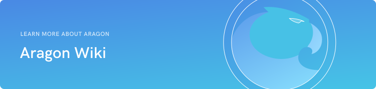

#  

We believe [decentralized organizations can solve the world’s worst problems](https://blog.aragon.org/decentralized-organizations-can-solve-the-worlds-worst-problems-840db6255d12). That's why we are building Aragon.

This wiki for the Aragon Project contains much of the content and resources available publicly.

If you feel like contributing to the wiki, like changing or adding things, feel free to create an [Issue](https://github.com/aragon/aragon-wiki/issues) or submit a [Pull Request](https://github.com/aragon/aragon-wiki/pulls) at [https://github.com/aragon/aragon-wiki](https://github.com/aragon/aragon-wiki).

For our website visit [aragon.org](https://aragon.org).

## **What does the wiki contain?**
You can use the menu to the left to navigate the wiki. Here is a brief summary of the contents:

- **<u>Documentation</u>**

    - Documents and papers related to the project
    - Developer resources
    - Information about the Aragon multisig structure and wallets

- **<u>Development</u>**

    - Technical descriptions and documentation for Aragon software projects

- **<u>Design</u>**

    - Visual assets of the Aragon project
    - App UI, brand guidelines, logos, merchandise, and more

- **<u>Meetings</u>**

    - Information and agendas for our public meetings

- **<u>Jobs</u>**

    - Details about our culture, work conditions and guide for applying to work at Aragon
    - Our current job openings

- **<u>Blog posts</u>**

    - Index and links to all of our blog posts

- **<u>Videos</u>**

    - Links to all our videos

- **<u>Press</u>**

    - Aragon Press Kit for Press/Media
    - Some media mentions
    - Contact information for media/press inquiries

- **<u>Archive</u>**

    - Old, deprecated documents and files that are kept for archiving purposes only

___

## What is Aragon?

<h3>Democratizing governance</h3>
**For a more fair, efficient world**

> We are building Aragon because we believe [decentralized organizations can solve the world’s worst problems](https://blog.aragon.org/decentralized-organizations-can-solve-the-worlds-worst-problems-840db6255d12).

Aragon is software that empowers you to freely organize and collaborate without borders or intermediaries. Create global, bureaucracy-free organizations, companies, and communities.

<h3>Goodbye unnecessary intermediaries</h3>
**Reclaim your independence**

> Aragon organizations are powered by Ethereum, a global blockchain for running unstoppable applications. In Ethereum, code and applications always run without any possibility of downtime or censorship.

Blockchain technology provides a single shared source of cryptographically verified truth. This is secured by a network made up of thousands of computers all over the globe. Anyone can set up their own node where all the necessary data is replicated across the network.

This decentralized design ensures a borderless and permissionless way of operating, without the fear of a government or a malicious third-party interfering.

<h3>Imagine a nation without land and borders</h3>
**A digital jurisdiction**

> Aragon Network will be the first community governed decentralized organization whose goal is to act as a digital jurisdiction, an online decentralized court system that isn’t bound by traditional artificial barriers such as national identity or the borders of a single country.

Aragon organizations can be upgraded seamlessly using our aragonOS architecture. They can solve disputes between two parties by using the decentralized court system, a digital jurisdiction that operates only online and utilizes your peers to resolve issues.

The Aragon Network Token, ANT, puts the power into the hands of the people participating in the operation of the Network. Every single aspect of the Network will be governed by those willing to make an effort for a better future.

### **Aragon client**

<h2>Decentralized application to run your organization</h2>

<h3>Transfer tokens</h3>
**Tokens represent your stake in the organization**

Your organization is in control of its funds. Transfer and assign them according to your personal needs without artificial limitations.

<h3>Fundraising</h3>
**Grasp the potential of a new form of crowdfunding**

Utilize the power of the crowd for funding and raise funds globally, in private or publicly, without relying on banks or financial gatekeepers.

<h3>Voting</h3>
**Decision-making by voting**

Use voting for more effective results. Votes are a secure, transparent and unforgeable way to come to a decision on major issues.

<h3>Payments</h3>
**Instant payments in a few clicks**

Adding a new employee to your organization and payroll is as easy as creating a new recurring payment.

<h3>Accounting</h3>
**Tamper-proof, effective accounting**

> Every transaction is recorded and can be verified on the blockchain at any given time

Unprecedented level of transparency can be gained through the use of a public blockchain to engrave every entry permanently on the ledger.

Pre-established rules can automatically define your quarterly spending and budgeting.

<h3>Permissions</h3>
**Flexible and resilient privilege escalation**

> Fine-grained permissions deliver the freedom to create an organization that will work for you.

Permissions can be granular and assigned in fine detail. You can choose to give people a certain degree of control over the organization and privileges can be escalated easily through a voting or different mechanisms if the person isn't allowed to directly perform a desired action.

By assigning different permissions to people, you can create the kind of organizational structure that is best suited for your needs.

### **Aragon Network**

<h2>Ensuring the success of decentralized organizations</h2>

**Putting the power back into the hands of the users**

> The Aragon Network will decentralize its governance by gradually handing over control of the project to its users.

The Aragon Network will establish additional services for the organizations taking advantage of what Aragon provides.

Our mission is to make the Aragon Network an autonomous organization itself, which is managed by the people using it for their mutual prosperity.

<h3>Aragon governance proposals</h3>
**[Join us in improving Aragon by making your voice heard](https://github.com/aragon/AGPs)**

[Aragon Governance Proposals](https://github.com/aragon/AGPs) is a system for community members to join the discussion and create proposals affecting Aragon.

Everyone is welcome to [join in and aid](https://github.com/aragon/AGPs) in forging the future of how Aragon will shape out to be. Together we can build the exciting future we want to see.

### **Why Aragon?**

> Aragon was born to bring transparency and independent governance to the forefront of managing an organization. We want to give people the freedom they deserve to run their lives.

Organizations like companies exist to create value for their communities. They use the resources available to them in order to provide services and to create products.

Their ability to do this efficiently is hindered by factors outside of their influence. By removing unnecessary intermediaries and third parties that impose artificial restrictions and unnecessarily complex regulations, we can modernize the way organizations are run.

<h3>Our vision</h3>
**Evolution of the internet and blockchain technology are changing the ways we interact with each other**

We believe that the progression of modern technology solutions, such as the invention of the blockchain, are changing the incentives for people to interact with each other. We are building the tools for the next generation of organizations to take advantage of this revolution.

Experimenting with new governance models has been a very risky endeavour during previous iterations of society. Now, for the first time in human history, we can let a thousand new governance models emerge, all from the comfort of our laptops.

## Communication channels

Aragon Mailing List - [https://one.us15.list-manage.com/subscribe?u=a590aa3843a54b079d48e6e18&id=e81a44c4bd](https://one.us15.list-manage.com/subscribe?u=a590aa3843a54b079d48e6e18&id=e81a44c4bd)

Discord - [https://discordapp.com/channels/672466989217873929/672466989767458861](https://discordapp.com/channels/672466989217873929/672466989767458861)

Spectrum - [https://spectrum.chat/aragon](https://spectrum.chat/aragon)

Aragon Forum - [https://forum.aragon.org](https://forum.aragon.org)

Reddit - [https://www.reddit.com/r/aragonproject/](https://www.reddit.com/r/aragonproject/)

Twitter - [https://twitter.com/aragonproject](https://twitter.com/aragonproject)

LinkedIn - [https://www.linkedin.com/company/aragonproject/](https://www.linkedin.com/company/aragonproject/)

YouTube - [https://www.youtube.com/c/AragonProject](https://www.youtube.com/c/AragonProject)
