# Aragon Press Kit

<h6>Here we have compiled resources and guides for press and media to use when referring to the Aragon Project brand.</h6>

!!! quote ""
    ## Aragon Press/Media Contact

    If you want to get in touch with us about an interview, commentary, or other media/press related matter, please send an email to **media at aragon dot one**.

!!! abstract ""
    ## Brand Guidelines

    The current version of the Aragon Project brand guidelines can be found [**here**](https://archive.org/download/aragon_brand_guidelines/GUIDELINES_BRAND_ARAGON.pdf).

    !!! warning ""
        <small>Large filesize, PDF is approximately 52MB.</small>

## Aragon Resources

!!! quote ""
    ### Aragon Project

    Find a full set of Aragon Project resources under [Design section](../design/logo/) of the Wiki.

    [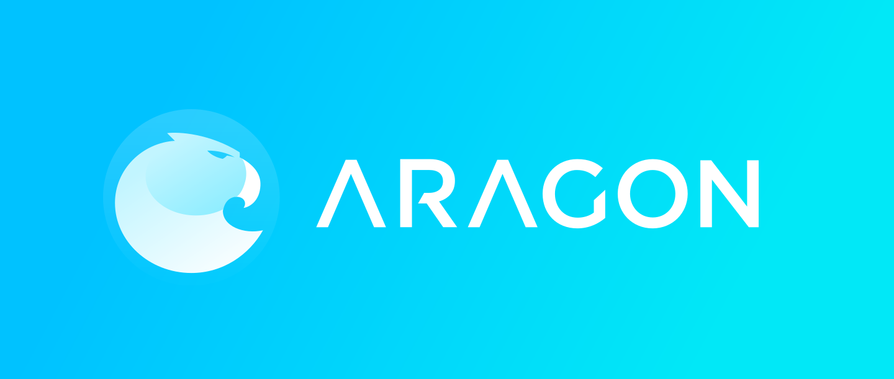](../../design/logo/)

!!! quote ""
    ### Aragon Network Token

    Find a full set of Aragon Network Token resources under [Design section](../design/artwork/#aragon-network-token) of the Wiki.

    

!!! quote ""
    ### Aragon Network

    Find a full set of Aragon Network resources under [Design section](../design/artwork/#aragon-network) of the Wiki.

    

## Founders

!!! abstract "Luis Cuende – Aragon Project Co-Founder & CEO of Aragon One"
    Luis has been awarded as the best underage European programmer in 2011, is a [Forbes 30 Under 30](https://www.forbes.com/30-under-30-europe-2016/technology/#6662a3e4a4b3), a [MIT TR35](hhttps://www.innovatorsunder35.com/the-list/luis-cuende/) and was an Advisor to the VP of the European Commission.

    He cofounded the blockchain startup [Stampery](https://stampery.com/). Prior to founding startups, he created the world's first Linux distribution with facelogin. Advisor to a few crypto projects that awake his curiosity.

    

!!! abstract "Jorge Izquierdo – Aragon Project Co-Founder & CTO of Aragon One"
    Curious hacker, creator of multiple apps for iOS and macOS. Reached App Store's #2. Always tinkering with new tech. Named as a [2017 class of Thiel Fellows](https://www.businesswire.com/news/home/20170616005607/en).

    Already convinced about the decentralized future of the Internet, he has been building toy projects such as a [mesh network](http://github.com/izqui/net) or a small [blockchain implementation](http://github.com/izqui/blockchain) since 2014.

    

!!! quote ""
    ## AraCon

    [AraCon – The first Aragon Conference](https://AraCon.one/) - took place in **Berlin, Germany on January 29th-30th 2019**. Aragon’s flagship event brought together people who embody and wish to shape the Aragon community.

    AraCon was the place for people to get a great understanding of Web 3.0, blockchain-based organizations and Aragon. The attendees discovered the latest developments and glimpses of what's to come. The goal for the conference was to provide a great overview of the decentralized web and how decentralized organizations can tackle some of the most pressing issues of today’s society.

    **Website:** [https://AraCon.one/](https://AraCon.one/)  
    **Announcement video:** [https://youtu.be/49hXxj31e7c](https://youtu.be/49hXxj31e7c)

### Resources for AraCon

!!! quote "Logo with background"
    [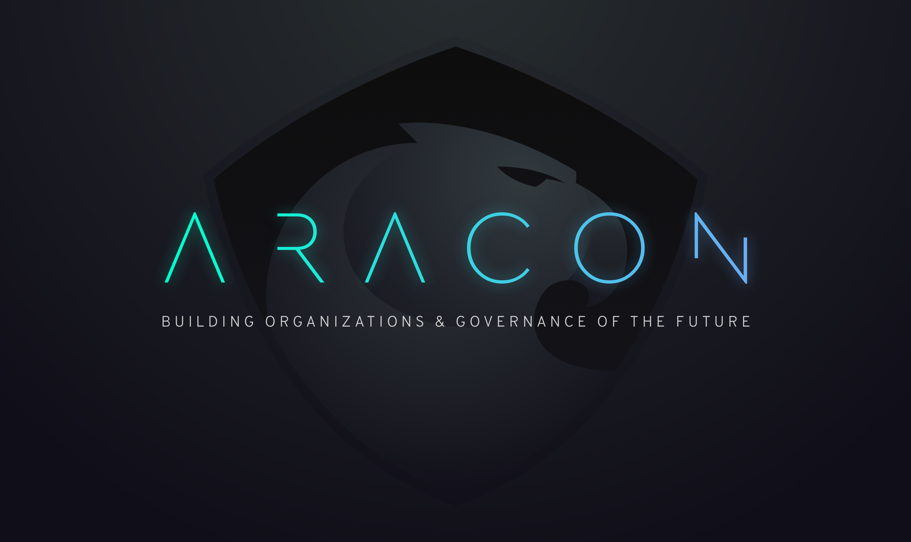](../design/logo/AraCon/AraCon_logo.png)
___
!!! quote "Logo with background (small)"
    [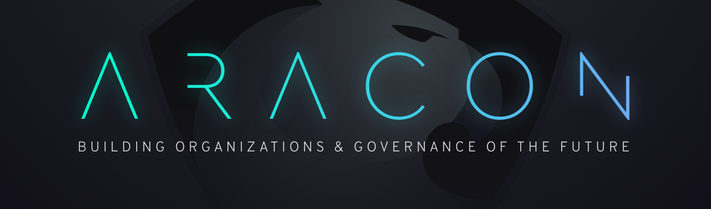](../design/logo/AraCon/AraCon_logo_small.png)
___
!!! quote "Text logo with dark text"
    [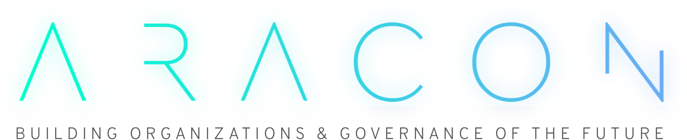](../design/logo/AraCon/AraCon_typography_dark.png)
___
!!! quote "Text logo with light text"
    [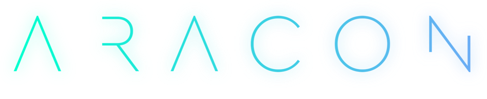](../design/logo/AraCon/AraCon_typography.png)
___
!!! quote "Announcement graphics"
    [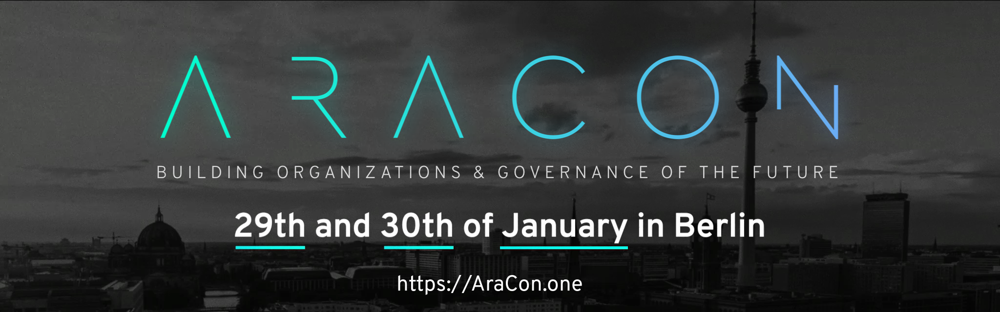](../design/logo/AraCon/aracon12.png)
    [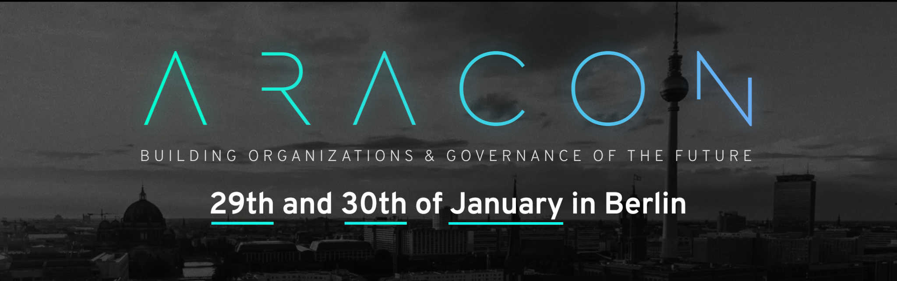](../design/logo/AraCon/aracon11.png)
___
!!! quote "Themes"
    [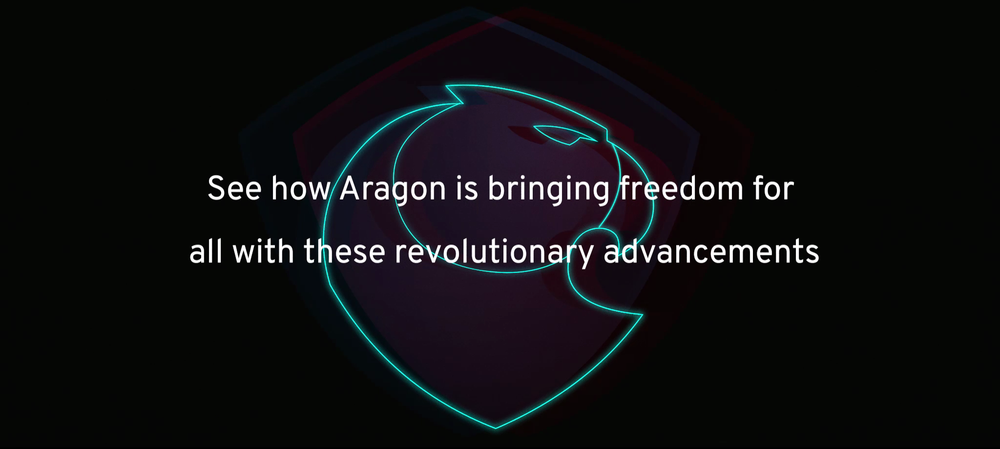](../design/logo/AraCon/aracon_themes01.png)
    ___
    [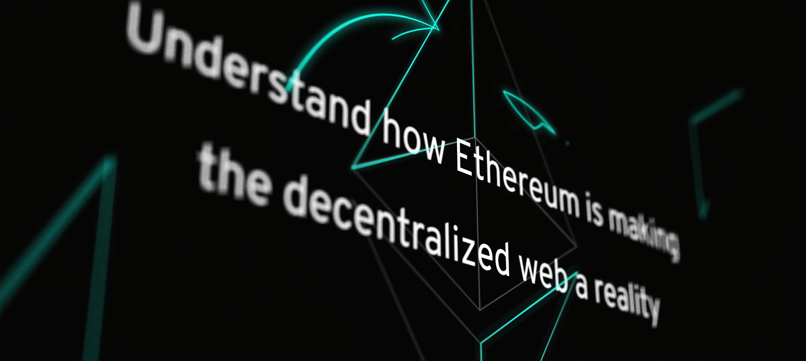](../design/logo/AraCon/aracon_themes02.png)
    ___
    [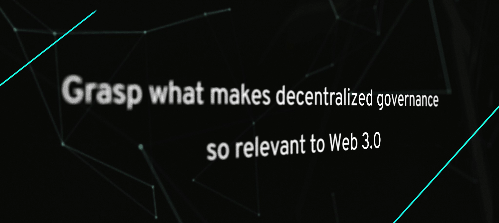](../design/logo/AraCon/aracon_themes03.png)
    ___
    [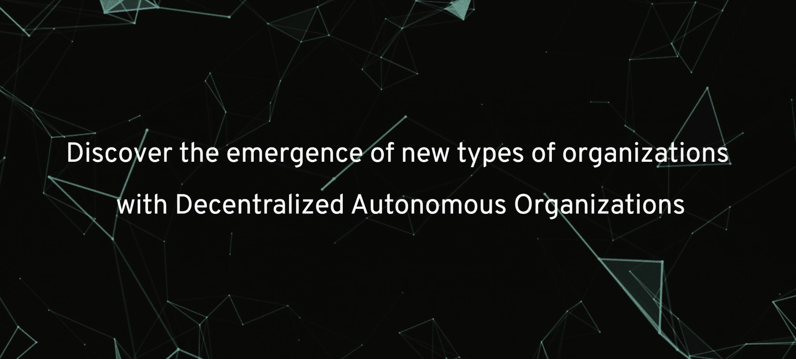](../design/logo/AraCon/aracon_themes04.png)
