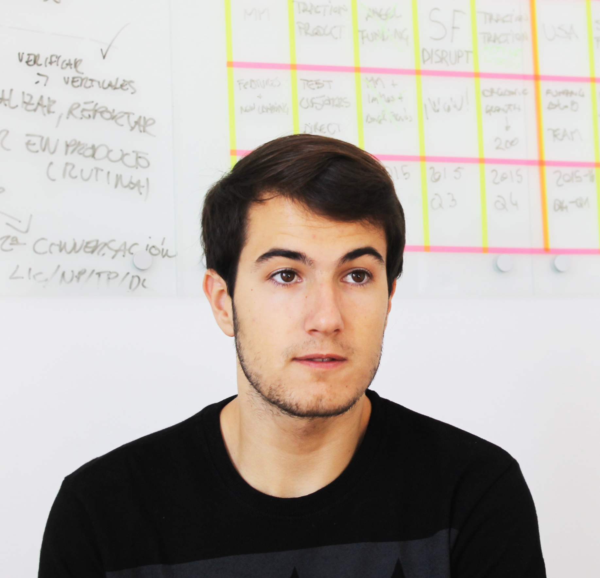

# Aragon Press Kit

Here we have compiled resources and guides for press and media to use when referring to the Aragon Project brand.

## Aragon Press/Media Contact

If you want to get in touch with us about an interview, commentary, or other media/press related matter, please send an email to media at aragon dot one.

## Brand Resources

### Logo

#### Imagetypes

##### Horizontal
[SVG](../../../design/logo/svg/imagetype.svg) | [PNG](../../../design/logo/png/imagetype.png)

[SVG](../../../design/logo/svg/imagetype_light.svg) | [PNG](../../../design/logo/png/imagetype_light.png)

#### Isotypes

[PNG](../../../design/logo/png/isotype.png) | [SVG](../../../design/logo/svg/isotype.svg)

[PNG](../../../design/logo/png/isotype_blue.png) | [SVG](../../../design/logo/svg/isotype_blue.svg)

### Images

#### General

## Team

### Luis Cuende - Aragon Project Co-Founder & CEO of Aragon One
> Luis has been awarded as the best underage European programmer in 2011, is a [Forbes 30 Under 30](https://www.forbes.com/30-under-30-europe-2016/technology/#6662a3e4a4b3), a [MIT TR35](hhttps://www.innovatorsunder35.com/the-list/luis-cuende/) and was an Advisor to the VP of the European Commission.

> He cofounded the blockchain startup [Stampery](https://stampery.com/). Prior to founding startups, he created the world's first Linux distribution with facelogin. Advisor to a few crypto projects that awake his curiosity.

### Jorge Izquierdo - Aragon Project Co-Founder & CTO of Aragon One
> Curious hacker, creator of multiple apps for iOS and macOS. Reached App Store's #2. Always tinkering with new tech. Named as a [2017 class of Thiel Fellows](https://www.businesswire.com/news/home/20170616005607/en).

> Already convinced about the decentralized future of the Internet, he has been building toy projects such as a [mesh network](http://github.com/izqui/net) or a small [blockchain implementation](http://github.com/izqui/blockchain) since 2014.

## AraCon

[AraCon – The first Aragon Conference](https://AraCon.one/) - will take place in **Berlin, Germany on January 29th-30th 2019**. Aragon’s flagship event will bring together people who embody and wish to shape the Aragon community.

AraCon will be the place for people to get a great understanding of Web 3.0, blockchain-based organizations and Aragon. The attendees will discover the latest developments and glimpses of what's to come. The goal for the conference is to provide a great overview of the decentralized web and how decentralized organizations can tackle some of the most pressing issues of today’s society.

**Website:** [https://AraCon.one/](https://AraCon.one/)  
**Announcement video:** [https://youtu.be/49hXxj31e7c](https://youtu.be/49hXxj31e7c)

### Resources for AraCon

#### Logo with background

___
#### Logo with background (small)

___
#### Text logo with dark text

___
#### Text logo with light text

___
#### Announcement graphics

___
#### Themes

___

___

___

___
