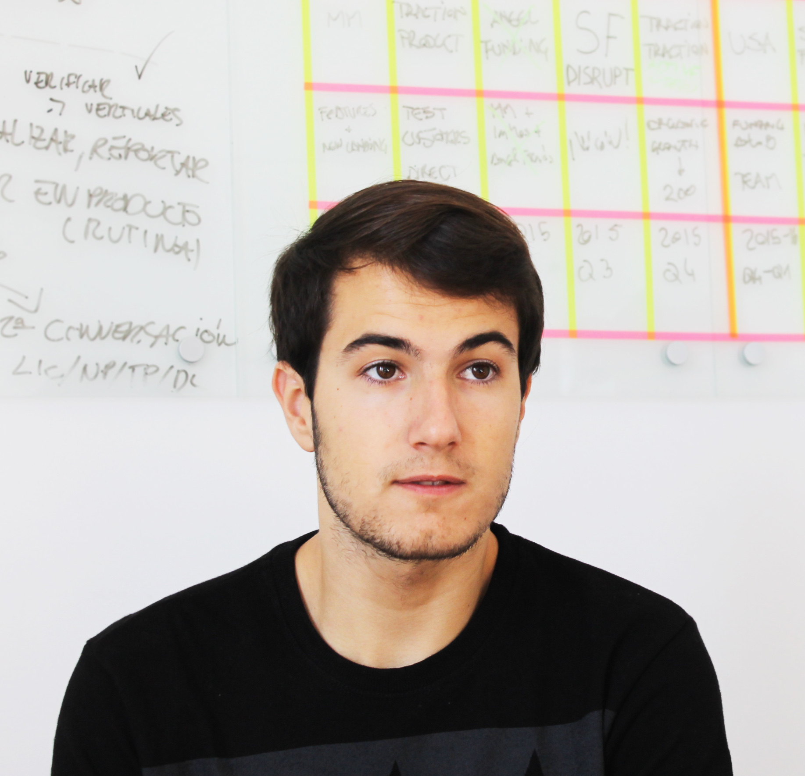

# Aragon Press Kit

Here we have compiled resources and guides for press and media to use when referring to the Aragon Project brand.

## Brand Guidelines

### [Identity Guidelines](../design/identity_guidelines.md)
> This document contains all you need to know about how the Aragon identity should be used in different contexts.

[Identity Guidelines](../design/identity_guidelines.md) includes information about the brand colors, the structure etc.

## Brand Resources

### Logo

#### [Brand in Sketch format](../../design/logo/brand.sketch)

#### Imagetypes

##### Horizontal
[SVG](../../design/logo/svg/imagetype.svg) | [PNG](../../design/logo/png/imagetype@2x.png) | [Light text SVG](../../design/logo/svg/imagetype_light.svg) | [Light text PNG](../../design/logo/png/imagetype_light@2x.png) | [Dark background JPG](../../design/logo/jpg/imagetype_dark@2x.jpg)

 

##### Vertical
[PNG](../../design/logo/png/imagetype_vertical@2x.png) | [Light text PNG](../../design/logo/png/imagetype_vertical_light@2x.png) | [Dark background JPG](../../design/logo/jpg/imagetype_vertical_dark@2x.jpg)

 

#### Logotypes
##### Default
[SVG](../../design/logo/svg/logotype.svg) | [PNG](../../design/logo/png/logotype@2x.png) | [Light version SVG](../../design/logo/svg/logotype_light.svg) | [Light version PNG](../../design/logo/png/logotype_light@2x.png) | [Dark background JPG](../../design/logo/jpg/logotype_dark@2x.jpg)

 

#### Isotypes
##### Stroke
[Sketch](../../design/logo/svg/aragon_stroke.sketch) | [PNG](../../design/logo/png/stroke.png)

##### Default
[SVG](../../design/logo/svg/isotype.svg) | [PNG](../../design/logo/png/isotype@2x.png)

### Images

#### General

#### Aragon Network Token

#### Aragon Network Jurisdiction

#### Aragon Company Registry

#### Aragon Chat

#### Gradient Background

## Aragon Core Screenshots

> _Please keep in mind that these are all currently **mockups** of the upcoming [v0.5 release](../../documentation/Development_Plan/#05-the-refactor-release)_

### Home + Notifications

### Ownership

> _Please keep in mind that these are all currently **mockups** of the upcoming [v0.5 release](../../documentation/Development_Plan/#05-the-refactor-release)_

### Voting

> _Please keep in mind that these are all currently **mockups** of the upcoming [v0.5 release](../../documentation/Development_Plan/#05-the-refactor-release)_

### Fundraising

> _Please keep in mind that these are all currently **mockups** of the upcoming [v0.5 release](../../documentation/Development_Plan/#05-the-refactor-release)_

### Finance

> _Please keep in mind that these are all currently **mockups** of the upcoming [v0.5 release](../../documentation/Development_Plan/#05-the-refactor-release)_

### Bylaws

> _Please keep in mind that these are all currently **mockups** of the upcoming [v0.5 release](../../documentation/Development_Plan/#05-the-refactor-release)_

### Settings

> _Please keep in mind that these are all currently **mockups** of the upcoming [v0.5 release](../../documentation/Development_Plan/#05-the-refactor-release)_

## Team

### Luis Cuende - Co-Founder & Project Lead at Aragon
> Luis has been awarded as the best underage European programmer in 2011, is a [Forbes 30 Under 30](https://www.forbes.com/30-under-30-europe-2016/technology/#6662a3e4a4b3), a [MIT TR35](http://www.innovatorsunder35.com/innovator/luis-cuende) and was an Advisor to the VP of the European Commission.

> He cofounded the blockchain startup [Stampery](https://stampery.com/). Prior to founding startups, he created the world's first Linux distribution with facelogin.

### Jorge Izquierdo - Co-Founder & Tech Lead at Aragon
> Curious hacker, creator of multiple apps for iOS, macOS and Pebble. Reached App Store's #2. Always tinkering with new tech. Named as a [2017 class of Thiel Fellows](https://www.businesswire.com/news/home/20170616005607/en).

> Already convinced about the decentralized future of the Internet, he has been building toy projects such as a [mesh network](http://github.com/izqui/net) or a small [blockchain implementation](http://github.com/izqui/blockchain) since 2014.

