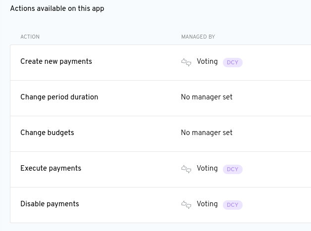

# Aragon User Guide

**Documentation Version 1.0.6**

**Aragon Version 0.6**

# 0. Introduction

Aragon is an application for creating and governing organizations - such as clubs, corporations, nonprofits, and open source projects - on [Ethereum](https://ethereum.org/)-compatible [blockchain](https://en.wikipedia.org/wiki/Blockchain) networks. Aragon currently supports creating organizations on the main Ethereum network (“mainnet”) and the Rinkeby test network (“testnet”).

You can find more information about the Aragon project, decentralized organizations, governance, and other related topics in [the Aragon wiki](https://wiki.aragon.org/).

## 0.1 Anatomy of an Aragon organization

An Aragon organization is made up of software programs known as “smart contracts”. While traditional legal contracts are ultimately enforced by coercion and the ability to physically seize assets in case one party to the contract does not fulfill their obligations, smart contracts are enforced by computers that ensure the contract is executed exactly as it is programmed. This “self-enforcing” property of smart contracts can reduce the risk involved in certain types of contracts.

The smart contract system Aragon is built on is called [aragonOS](https://hack.aragon.org/docs/aragonos-intro.html). This system ensures that only authorized accounts and contracts (what Aragon refers to as “entities”) have permission to perform specific actions in an organization. The same way that a legal contract defines what rights and obligations a party to the contract has, the aragonOS smart contracts define what rights and obligations entities have in an Aragon organization.

Each Aragon organization has apps that can be “installed” on aragonOS. These apps extend the functionality of the organization and give members new ways of interacting with each other and the organization itself. Some examples of applications that can be added to Aragon organizations are the Token Manager, Voting, Finance, and Permissions apps. Anyone can develop their own app, add it to their own organization, and publish it for others to use as well.

You can find more information about the technical details of how Aragon works, including how to develop your own Aragon app, in the [Aragon Developer Portal](https://hack.aragon.org/docs/stack.html).

# 1. Prerequisites

In addition to a working laptop or desktop computer with a decent internet connection, you will need the following to start using Aragon:

- Up-to-date [Brave](https://brave.com/), [Chrome](https://www.google.com/chrome/)/[Chromium](https://www.chromium.org/getting-involved/download-chromium), [Firefox](https://www.mozilla.org/firefox/), or [Opera](https://www.opera.com/download) web browser.

- An Ethereum provider such as [MetaMask](https://metamask.io/) and a compatible Ethereum wallet such as [Ledger](https://www.ledger.com/) or [Trezor](https://trezor.io/) if your Ethereum provider either does not have key management ("wallet") functionality built-in or you prefer not to use the built-in wallet functionality.

- If you are using Aragon on mainnet, you will need to set your Ethereum provider to use the Main Ethereum Network. You will then need to load your wallet with enough ETH to pay for gas when you deploy your organization and make transactions within the organization. ETH can be acquired from a cryptocurrency exchange that lists ETH. As a rough estimate of how much ETH you should start with, multiply 20,000,000 times the [current “standard” gas price](https://ethgasstation.info/) times 0.000000001 to find out how much ETH you need. For example, at a current standard gas price of 10 gwei, you should start with 0.2 ETH.

- If you are using Aragon on testnet, you will need to set your Ethereum provider to use the Rinkeby Test Network. You will then need to load your wallet with test ether for the Ethereum Rinkeby test network. This test ether is used to pay for gas when you deploy your organization and make transactions within the organization. You can try the [Rinkeby faucet](https://faucet.rinkeby.io/) or post your Ethereum Rinkeby testnet address in the [#faucet channel on Aragon Chat](https://aragon.chat/faucet) to receive test ether for free. Please wait patiently for an Aragon team member to see your message if you post your faucet request in the Aragon Chat.

# 2. Templates

Templates are pre-configured smart contracts for different types of organizations. You can use the templates that are included with Aragon or create your own. Aragon currently includes two templates: Democracy and Multisig. This section will walk you through examples of how you can use these templates as a starting point for your organization.

## 2.1 Create a new Democracy organization

#### 2.1.1 Navigate to [app.aragon.org](https://app.aragon.org) in your web browser

Select which network you want to use to create your organization then click "Create a new organization".

### 2.1.2 Select “Token project with Democracy” then click “Next”

A “Token project with Democracy” is an organization where the vote cast by a token holder is weighted proportionally to their ownership stake of tokens minted by the organization. For example, if a tokenholder owns 5% of the tokens minted by the organization then their vote will count as 5% of the total votes on a given proposal.

### 2.1.3 Claim a domain name then click “Next”

Aragon uses the [Ethereum Name Service](https://ens.domains/) (ENS) to assign names to organizations.

*Note: This name currently cannot be changed.*

### 2.1.4 Set the parameters of your Democracy organization then click “Next”

“Support” is the number for what percent of the tokens that participated in a vote must approve a proposal for that proposal to pass. For example, if “Support” is set to 51%, then 51% of tokens that vote on a proposal must approve the proposal for it to pass.

“Min. Quorum” is short for “Minimum Acceptance Quorum. “Min. Quorum” is the number for what percent of the total outstanding supply of token must approve a proposal for the vote to be considered valid. For example, if the Min. Quorum is set to 20%, then 20% of the outstanding token supply must vote to approve a proposal for the vote to be considered valid. If a vote does not make quorum, then it will fail, even if more tokens voted to approve the proposal than voted against it. For example, if the Min. Quorum is set to 20% and 10% of the outstanding token supply votes against the proposal but only 15% vote in support, then the proposal will fail because it has not reached the Min. Quorum threshold.

“Vote Duration” is the length of time that the vote will be open for participation. For example, if the Vote Duration is set to 24 H, then tokenholders have 24 hours to participate in the vote. After the 24 hours is over, if the vote has not been approved by a majority of tokenholders and/or does not make quorum, then the vote will automatically fail. If the vote makes quorum and receives approval by a majority of tokenholders by the end of the Vote Duration, then the vote will automatically pass.

### 2.1.5 Choose token name and symbol then click “Next”

*Note: The token name and symbol cannot currently be changed.*

### 2.1.6 Sign organization creation transactions

Now you need to sign two transactions in MetaMask to create your organization. Open MetaMask if the wallet window does not open automatically. After the first transaction is confirmed, the second transaction may show up in MetaMask as a transaction with an “unapproved” label, indicating that it needs to be signed. Click the transaction to open and sign it.

### 2.1.7 Click “Get Started”

Your new Democracy organization is ready to go!

## 2.2 Explore the Democracy organization

### 2.2.1 Home app

The Home app welcomes you to your organization and offers you several options for different actions you can take. You can also use the menu on the left-hand side of the screen to view the different apps that are currently installed for your organization. Aragon currently has the Token Manager, Voting, Finance, and Permissions apps installed, with an App Center coming soon.

### 2.2.2 Token Manager app

The Token Manager is the app you use to mint new tokens and assign them to yourself or other entities.

You can mint new tokens by following these steps:

#### 2.2.2.1 Click “Assign Tokens” button

Enter the address of the recipient of the tokens and the number of new tokens you want to mint and assign to that address, then click “Assign Tokens”.

#### 2.2.2.2 Create vote to assign tokens

Even though you are the only tokenholder, the Democracy organization still requires a tokenholder vote for every action. Click “Sign Transaction” to sign the transaction that creates a new vote to assign the new token you want to mint. 

*Note: Creating a vote will automatically make your account vote “Yes” on the proposal. You can change your vote by opening the vote in the Voting app, clicking the “No” button, and signing the transaction to change your vote to “No”.*

#### 2.2.2.3 Sign and send transaction to create the “Assign Tokens” vote

After clicking “Sign Transaction”, a notification will pop-up in MetaMask. Open MetaMask, then sign and send the transaction to create the vote.

#### 2.2.2.4 Check out the newest member of your organization

Since you are the only tokenholder, the vote will automatically pass and the token will automatically be assigned to the entity you added in 2.2.2.1. A good start to a new Democracy organization!

### 2.2.3 Voting app

The Voting app makes it easy for you to poll your fellow tokenholders about their position on an infinite range of topics. Votes initiated by other Aragon apps also show up in the Voting app. For example, assigning tokens using the Token Manager or moving funds from the Finance app are each actions that require a vote by tokenholders in a Democracy organization.

Follow these steps to create a new vote and poll your community about a topic you care about:

#### 2.2.3.1 Click “New Vote”

Fill out the question you want to poll your community about and click “Begin Vote”.

#### 2.2.3.2 Sign transaction to create new vote

Click the “Create transaction” button, then open your MetaMask wallet to sign and send the transaction.

#### 2.2.3.3 Ask the other tokenholders to review and vote on the proposal

Rally your fellow tokenholders outside the app - for example, by email, forum, chat room, or good old fashioned face-to-face - and ask them to review and vote on the proposal. Tokenholders can visit the Voting app to see the list of open votes and cast their ballot accordingly.

#### 2.2.3.4 Other tokenholders cast their vote

In this case, the other tokenholder in the organization supports deploying the organization to mainnet. They sent a follow-up email saying that security audit came back with good results, so they will vote “yes”.

#### 2.2.3.5 Review the vote

Since there are only two token-holders in this organization, and the Support parameter is set to 51%, the unanimous vote on the question of whether or not the organization should be deployed to mainnet next week has resulted in an approved (or “Executed”) vote. A vote with a status of “Executed” does not need any further action to be taken.

### 2.2.4 Settings app

The Settings app is where you can find the internal addresses for your organization, as well as troubleshoot issues you are having with Aragon. If you want to send ETH or tokens to your organization, make sure to use the Finance app address. When using testnet you also have the ability to request test tokens, which will be sent to the organization’s Finance app.

### 2.2.5 Finance app

The Finance app is the app that provides tokenholders with access to the funds held by their organization. The Finance app shows the current balance in ETH and tokens as well as the transaction history of the organization. You can also use the Finance app to initiate a new transfer of funds.

Follow these steps to create a new transfer from the Finance app:

#### 2.2.5.1 Send ETH or tokens to your organization

**On mainnet**

Go to the Settings app and copy the Finance app address. Open MetaMask to sign and send the desired amount of ETH or tokens to the Finance app address. About a minute or so after your transaction is confirmed, the funds will appear in the Finance app of your organization. You can then create a new transfer to send these funds to another address.

**On testnet**

Go to the Settings app and press the “Request test tokens” button. Open MetaMask to sign and send the transaction. About a minute or so after your transaction is confirmed, test tokens will be sent to the Finance app address of your organization. You can then create a new transfer to send these tokens to another address.

#### 2.2.5.2 Click “New Transfer” to initiate a new transfer from the Finance app

Go to the "Withdrawal" tab then enter the address of the recipient and the amount of tokens to send them, along with an optional reference note about what the transfer is for. Then click “Submit Transfer”.

#### 2.2.5.3 Sign the transaction to create the New Transfer vote

As mentioned before, all actions in the Democracy organization require a vote by tokenholders. Click “Sign Transaction” then open MetaMask to sign and send the transaction that creates the New Transfer vote.

#### 2.2.5.4 Ask the other tokenholders in the organization to review and vote on the transfer

The payment is intended to compensate another tokenholder in the organization for design work they did, so they waste no time reviewing and voting to approve the transfer.

#### 2.2.5.5 The vote transaction is signed and sent to approve the transfer

After confirmation, the transfer will execute.

#### 2.2.5.6 Review the transfer in the Finance app

Go back to the Finance app to see a record of the transfer and a link to the transaction record on the blockchain.

## 2.3 Create a Multisig organization

#### 2.3.1 Navigate to [app.aragon.org](https://app.aragon.org) in your web browser

Select which network you want to use to create your organization then click "Create a new organization".

### 2.3.2 Select “Token project with Multisig” then click “Next”
A “Token project with Multisig” is an organization where the resources of the organization are controlled by m-of-n members of a multisig contract, where n is 100% of tokenholders and m is the Min. Quorum percentage of tokenholders that must approve a vote for it to pass. For example, in a 2-of-2 multisig DAO, two signatures from two different specified accounts are required for a proposal to pass.

If more tokens are minted for additional accounts, then the number of signatures required may increase as well to maintain the required Min. Quorum. For example, starting with a 2-of-3 multisig (66% Min. Quorum) and issuing one token to a new account will make the DAO a 3-of-4 multisig, issuing one more token to yet another new account will make the DAO a 4-of-5 multisig, and so on.

### 2.3.3 Claim a domain name then click “Next”

Aragon Core uses the [Ethereum Name Service](https://ens.domains) (ENS) to assign names to organizations.

*Note: This name currently cannot be changed.*

### 2.3.4 Enter the accounts and the parameters of the multisig contract

First enter the addresses of the accounts that you want to be members of the multisig. Then set the number of signatures out of those accounts that will be required to approve votes in the multisig. For example, you can enter three accounts and require any two of their signatures to approve a vote (“2-of-3”). Up to six signers can be added during the organization creation process. If you need additional signers, you can add them after the organization is created by assigning a token to each of the accounts you want to join the organization.

### 2.3.5 Choose token name and symbol then click “Next”

*Note: The token name and symbol cannot currently be changed.*

### 2.3.6 Sign organization creation transactions

Now you need to sign two transactions in MetaMask to create your organization. Open MetaMask if the wallet window does not open automatically. After the first transaction is confirmed, the second transaction may show up in MetaMask as a transaction with an “unapproved” label, indicating that it needs to be signed. Click the transaction to open and sign it.

### 2.3.7 Click “Get Started”

Your new Multisig organization is ready to go!

## 2.4 Explore the Multisig organization

### 2.4.1 Home app

The Home app welcomes you to your organization and offers you several options for different actions you can take. You can also use the menu on the left-hand side of the screen to view the different apps that are currently installed for your organization. Aragon currently has the Token Manager, Voting, Finance, and Permissions apps installed, with an App Center coming soon.

### 2.4.2 Token Manager app

The Token Manager is the app you use to mint new tokens and assign them to other entities.

You can mint new tokens by following these steps:

#### 2.4.2.1 Click “Assign Tokens” button

Enter the address of the recipient of the tokens and the number of new tokens you want to mint and assign to that address, then click “Assign Tokens”.

*Note: Each tokenholder in a multisig organization can only hold one token at a time. An error will be shown and the transaction will fail if you attempt to mint additional tokens for existing tokenholders.*

#### 2.4.2.2 Create vote to assign tokens

As mentioned before, in a Multisig organization m-of-n tokenholders are needed to approve every action. Click “Create transaction” to create the transaction that creates a new vote to assign the new token you want to mint, then sign the transaction to create the vote.

#### 2.4.2.3 Review the proposal and decide which way you want to vote

After you have created the proposal to assign the token, you need to cast your vote for the proposal. Open the Voting app and review the proposal. Vote “yes” if you want to approve the proposal or “no” if you want to reject the proposal.

#### 2.4.2.4 Create and sign the vote transaction

After you have decided which way you want to vote, you need to create and sign the vote transaction. Review the details, click the “Create transaction” button to create the transaction, then sign the transaction to confirm your vote.

#### 2.4.2.5 Ask the other tokenholders to review and vote on the proposal

Rally your fellow tokenholders outside the app - for example, by email, forum, chat room, or good old fashioned face-to-face - and ask them to review and vote on the proposal. Tokenholders can visit the Voting app to see the list of open votes and cast their ballot accordingly. In this example, the other tokenholder in the organization is happy to add a new member. They sent a follow-up email saying that they'll vote “yes” right away.

#### 2.4.2.6 Check out the newest member of your Multisig DAO

After the other tokenholder votes to approve the proposal, go back to the Token Manager and see that the member you added is now in the list of tokenholders.

### 2.4.3 Voting app

The voting app makes it easy for you to poll your fellow tokenholders about their position on an infinite range of topics. Votes initiated by other Aragon apps also show up in the Voting app. For example, assigning tokens using the Token Manager or moving funds from the Finance app are each actions that require a vote by tokenholders in a Multisig organization.

Follow these steps to create a new vote and poll your community about a topic you care about:

#### 2.4.3.1 Click “New Vote”

Fill out the question you want to poll your community about and click “Begin Vote”.

#### 2.4.3.2 Sign transaction to create new vote

Click the “Create transaction” button, then open your MetaMask wallet to sign and confirm the transaction.

#### 2.4.3.3 Review the proposal and decide which way you want to vote

After you have created the proposal, you need to cast your vote for the proposal. Open the Voting app and review the proposal. Vote “yes” if you want to approve the proposal or “no” if you want to reject the proposal.

#### 2.4.3.4 Create and sign the vote transaction

After you have decided which way you want to vote, you need to create and sign the vote transaction. Review the details, click the “Create transaction” button to create the transaction, then sign the transaction to confirm your vote.

#### 2.4.3.5 Ask the other tokenholders to review and vote on the proposal

Rally your fellow tokenholders outside the app - for example, by email, forum, chat room, or good old fashioned face-to-face - and ask them to review and vote on the proposal. Tokenholders can visit the Voting app to see the list of open votes and cast their ballot accordingly.

#### 2.4.3.6 Review the vote

Since three of three tokenholders are required to vote “yes” to approve a transaction, the unanimous vote on the question of whether or not the organization should sponsor the next AraCon has resulted in an approved (or “Executed”) vote. A vote with a status of “Executed” does not need any further action to be taken.

### 2.4.4 Settings app

The Settings app is where you can find the internal addresses for your organization, as well as troubleshoot issues you are having with Aragon. If you want to send ETH or tokens to your organization, make sure to use the Finance app address. When using testnet you also have the ability to request test tokens, which will be sent to the organization’s Finance app.

#### 2.4.5 Finance app

The Finance app is the app that provides tokenholders with access to the funds held by their organization. The Finance app shows the current balance in ETH and tokens as well as the transaction history of the organization. You can also use the Finance app to initiate a new transfer of funds.

Follow these steps to create a new transfer from the Finance app:

#### 2.4.5.1 Send ETH or tokens to your organization

**On mainnet**

Go to the Finance app and click the “New Transfer” button. On the “Deposit” tab, enter the token you want to deposit, the amount, and an optional reference note. Click “Submit deposit” to complete the transfer. About a minute or so after your transaction is confirmed, the funds will appear in the Finance app of your organization. You can then create a new transfer to withdrawal these funds to another address.

**On testnet**

Go to the Settings app and press the “Request test tokens” button. Open MetaMask to sign and send the transaction. About a minute or so after your transaction is confirmed, test tokens will be sent to the Finance app address of your organization. You can then create a new transfer to send these tokens to another address.

#### 2.4.5.2 Click “New Transfer” to initiate a new transfer from the Finance app

Go to the "Withdrawal" tab, the enter the address of the recipient and the amount of tokens to send them, along with an optional reference note about what the transfer is for. Then click “Submit Transfer”.

#### 2.4.5.3 Sign the transaction to create the New Transfer vote

As mentioned before, all actions in the Multisig organization require a vote by tokenholders. Click “Sign Transaction” then open MetaMask to sign and send the transaction that creates the New Transfer vote.

#### 2.4.2.4 Review the proposal and decide which way you want to vote

After you have created the proposal to transfer the ETH, you need to cast your vote for the proposal. Open the Voting app and review the proposal. Vote “yes” if you want to approve the proposal or “no” if you want to reject the proposal.

#### 2.4.2.5 Create and sign the vote transaction

After you have decided which way you want to vote, you need to create and sign the vote transaction. Review the details, click the “Create transaction” button to create the transaction, then sign the transaction to confirm your vote.

#### 2.4.5.6 Ask the other tokenholders in the organization to review and vote on the transfer

The payment is intended to compensate another tokenholder in the organization for documentation work they did, so they waste no time reviewing and voting to approve the transfer. The third tokenholder votes as well. After confirmation, the vote will execute and the transfer will be made.

#### 2.4.5.8 Review the transfer in the Finance app

Go back to the Finance app to see a record of the transfer and a link to the transaction record on the blockchain.

# 3. Aragon apps

As mentioned in the earlier section **0.1 Anatomy of an Aragon organization**, Aragon organizations have the ability to extend their functionality using Aragon apps. The apps that come pre-installed with Democracy and Multisig organizations are:

- Token Manager

- Voting

- Finance

- Permissions

There is also a Home page, an Apps page, and a Settings page that every Aragon organization comes with by default. In this section we will explore each of these in detail.

## 3.1 Home

The Home page is a simple landing page that shows you the name of the organization you have loaded, as well as different actions that you can take using the pre-installed apps in your organization. For example, in the organization democracy.aragonid.eth we can perform the actions Assign Tokens, Vote, Check Finance, and New Payment. You can also check your network connection status at the bottom of the Home page.

## 3.2 Token Manager

The Token Manager is the app that is used to manage membership and voting power in an organization. To add members to an organization, it’s as easy as minting and assigning a token to them. 

With the Democracy template, one token equals one vote, and members can hold as many tokens as are issued to them. With the Multisig template, one token also equals one vote but members cannot hold more than one token each.

This simple process for managing membership and voting power provides the foundation for governing the resources of an organization.

### 3.2.1 Holders

In the Holders section of the Token Manager app you can see the current list of tokenholders and the balance of organization tokens they each hold. Clicking on the dropdown menu on one of the rows in the list will provide you options for assigning more tokens to that tokenholder or removing tokens from the tokenholder.

### 3.2.2 Token Info

In the Token Info section you can see information about the token that is used for governance in your organization:

- Token supply: how many tokens have been minted in total

- Transferable: whether or not the token can be transferred to another entity after it has been assigned

- Token: the token name and token symbol

### 3.2.3 Ownership Distribution
In the Ownership Distribution section you can see which entities own what percent of the organization’s token supply. This can be helpful as a spot check to see how token ownership is concentrated in the organization.

### 3.2.4 Assign Tokens

If you click the Assign Tokens button, a panel will open up with text fields for entering the address of the entity you want to assign tokens to and how many tokens you want to assign. After you enter this information, you can click the “Assign tokens” button in the panel to finish completing the action.

## 3.3 Voting

The Voting app is where you can see all open and past votes. You can also use the Voting app to start a new vote and poll tokenholders in the organization about an issue that is important to you.

### 3.3.1 Open votes

The “Open votes” section shows how many open votes there are and cards for each of the open votes, which show how much time is left in the vote, the number of the vote, a snippet of the issue being voted on, and the current status of the vote. You can click “view vote” to expand the card and either cast you vote if you have not voted yet or change your vote if you have already voted.

**Open votes - vote not cast**

**Open votes - vote already cast**

In each case, the “View vote” panel tells you more detailed information about the status of a vote, such as:

- Time remaining: how much time is left until the vote closes, should no other votes cast cause the vote to automatically pass.

- Total support: what percent of the total token supply is needed to vote “yes” for the vote to be valid, and what percent of the total token supply has voted “yes” so far.

- The question being voted on.

- What entity created the vote.

- Current votes: what percent of voters are required to vote “yes” for the vote to pass, what percentage of voters and how many tokens have voted “yes”, and what percentage of voters and how many tokens have voted “no”.

- If you have not yet cast your vote, buttons for voting “yes” or “no”.

- If you have already voted, a button for changing your vote.

- How much voting power your vote will have based on your token balance at the beginning of the vote, along with a link to the block that the vote snapshot was taken from.

### 3.3.2 Past votes

The “Past votes” section shows how many past votes there have been as well as cards for each of the past votes. Each card shows the date of the past vote, the number of the vote, a snippet of the issue being voted on, and the outcome of the vote.

Clicking on the “View vote” button will then show you more detailed information about the vote. See the previous section 3.3.1 for a detailed explanation of the information in the “View vote” panel.

### 3.3.3 New vote

If there is an important question you have that you want to poll tokenholders in the organization about, you can click the “New vote” button to start a new vote. These votes are purely informative and will not directly result in any further action being taken in the organization. After you have filled out the text field in the “New vote” panel with the question you want to ask, you can click “Begin vote” to complete the action and create a new vote if you have permission.

## 3.4 Finance

The Finance app is used to manage the financial resources of an organization. You can see the balance of each asset the organization owns, a history of past transfers, and also create new transfers from the Finance app.

### 3.4.1 Token Balances

The Token Balances section shows you the balance of each token owned by the organization.

### 3.4.2 Transfers

The Transfers section shows you a history of past transfers that have been made using the Finance app, including information about the date of the transfer, what address the transfer was to or from, a reference with additional context about the transfer, and the amount of the transfer.

The transfer history can be filtered by token:

Or transfer type:

And for each transfer, you can click on the drop down menu to get a link to view the transaction on the blockchain so you can see even more detail about the transfer:

### 3.4.3 New Transfer

To send funds to your organization, you can create a deposit using the Finance app. Click the "New Transfer" button, open the "Deposit" tab, select the token you want to deposit, enter the amount and an optional reference note, then click the "Submit deposit" button.

To create a new transfer from your organization to another address, you can create a withdrawal using the Finance app. Click the “New Transfer” button, open the "Withdrawal" tab, then enter the address you want to make the transfer to, what token you want to send, and the amount of tokens you want to send. You can optionally add a reference note to provide more context for the transfer. Once you have filled out all of this information you can click the “Submit transfer” button to complete the action, if you have permission.

## 3.5 Permissions

The Permissions app is used to view all of the current permissions that have been set in an organization and add or remove permissions as needed. The permissions set by the Permissions app define which entities have what permissions to perform various actions in an organization. For example, any account may have permission to create a vote but only tokenholders in an organization may have permission to cast a vote.

### 3.5.1 Browse by app

The Permissions app shows a list of every app installed in the organization and the address or token symbol of that app.

Every app has a list of actions that can be performed on the app, a list of actions that other entities have been given permission to perform on the app, and a list of permissions that the app has been granted.

#### 3.5.1.1 Actions available on this app

The “Actions available on this app” section shows what actions can be performed on the app and which entity manages each action. This entity is called a “manager”.

A manager has the ability to choose which entities have permission to perform an action and the ability to change the manager of that action. If a manager removes themself as a manager of a permission without re-assigning the manager role to another entity, then management of that action defaults to whichever entity manages the “Create permissions” action in the ACL app. If the manager of an action is set as `0xFFfFfFffFFfffFFfFFfFFFFFffFFFffffFfFFFfF` then no new manager can be set and permissions granted for that action will be locked forever.

If an action has not been given a manager yet, then it must be initialized. To initialize an action, enter the address of the entity that you want to manage the action, select which entity you want to grant permission to perform the action, then click the “Initialize permission” button to initialize the permission, if you have permission to do so.

#### 3.5.1.2 Permissions set on this app

The “Permissions set on this app” section shows which entities have permission to perform which actions on the app. If you are the manager of an action then you can revoke permission from any entity that has been granted permission to perform an action.

#### 3.5.1.3 Permissions granted to this app

The “Permissions granted” or “Permissions granted to this app” section shows which actions the entity has been granted to perform on which app. If you are the manager of an action in this section then you can revoke permission from the entity that has been granted permission to perform the action.

### 3.5.2 Browse by entity

Back on the main Permissions page, you have the ability to get an at-a-glance view of all of the permissions set in an organization in the “Browse by entity” section. Here, you can quickly see which entities have been granted permission to perform which actions in the organization. Clicking “View details” will take you to the permissions page for that entity.

### 3.5.3 Add permission

To give permission to an entity to perform an action on an app, click the “Add permission” button, select which app you want the entity to perform the action on, select which entity you want to grant the permission to, then select the action you want to grant the entity permission to perform.

Each app has different actions that an entity can be granted permission to perform. Granting permission to an entity to perform these actions on these apps will allow them to:

**ACL**

- Create permissions: create permissions in any app that uses this ACL instance

**EVM Script Registry**

- Add executors: add an executor to the organization`*`

- Enable and disable executors: enable and disable executors in an organization`*`

*Note: An executor is an interpreter for running scripts in an organization. All of the apps in an organization use the executors in the organization to execute scripts that are part of transactions sent to the app. Each script has an identifier that determines which executor is used for running the script. For example, whenever a vote transaction is sent to the Voting app, the app runs a script, then uses an executor to execute the script in the transaction. You can find more documentation about executors in the [Aragon Developer Portal](https://hack.aragon.org/docs/aragonos-ref.html#52-evmscripts).*

**Kernel**

- Manage apps: install apps, upgrade apps, and change default apps in an organization. The ACL and the EVM Script Registry are default apps in the organization. Whoever has permission to perform this action can also change the default Vault app of the organization (which is the Vault that tokens will be sent to if tokens are sent to an app that is not meant to accept token deposits).`*`

**Token Manager**

- Assign tokens: mint and assign the specified number of tokens to the specified entity

- Revoke vesting: revoke token vesting from the specified entity

- Mint tokens: mint tokens and transfer them to the organization’s Vault app

**Voting**

- Modify quorum: modify the Min. Quorum parameter

- Create new votes: create a new vote

- Modify support: modify the Support parameter

*Note: “Min. Quorum” is short for “Minimum Acceptance Quorum. “Min. Quorum” is the number for what percent of the total outstanding supply of token must approve a proposal for the vote to be considered valid. For example, if the Min. Quorum is set to 20%, then 20% of the outstanding token supply must vote to approve a proposal for the vote to be considered valid. If a vote does not make quorum, then it will fail, even if more tokens voted to approve the proposal than voted against it. For example, if the Min. Quorum is set to 20% and 10% of the outstanding token supply votes against the proposal but only 15% vote in support, then the proposal will fail because it has not reached the Min. Quorum threshold.*

*“Support” is the number for what percent of the tokens that participated in a vote must approve a proposal for that proposal to pass. For example, if “Support” is set to 51%, then 51% of tokens that vote on a proposal must approve the proposal for it to pass.*

**Finance**

- Create new payments: create a transfer from the Finance app to another entity

- Execute payments: trigger a recurring payment owed to an entity

- Disable payments: enable and disable recurring payments

**Vault**

- Transfer Vault’s tokens: transfer tokens in the Vault app

`*` *These actions are very sensitive actions that will give the entity with permission to perform these actions almost complete control of your organization.*

## 3.6 Apps

The Apps page is not an app yet but shows other apps that are currently in development. In the future, this page will be an app that you can use to browse and install apps that are available to be installed in your organization.

## 3.7 Settings

The Settings page has information about your organization, including the addresses of the installed app and the network addresses of the Ethereum and IPFS nodes your Aragon client is connected to. There is also a button that can help you troubleshoot any issues you are experiencing with your Aragon client. 

If you are using Aragon on testnet, you can also request test tokens from the Settings page. These tokens will be deposited into your organization’s Finance app.

**If you want to send tokens to your organization, be sure to send them to the organization’s Finance app address.**

# 4. Troubleshooting

- If your browser closes after signing the first transaction to create your organization but before the second transaction appears in your Ethereum provider:

  - Leave a message in the [Aragon Chat #feedback channel](https://aragon.chat/channel/feedback) describing what happened. At their soonest availability, someone from the Aragon development team will then help you create, sign, and broadcast the second transaction.

- If you are having trouble performing an action that you expect you should be able to perform:

  - Make sure your Ethereum provider is unlocked, on the correct network, and open to the correct account. Try the action again, and if it still doesn’t work...

  - Reload the page in your browser. Try the action again, and if it still doesn’t work...

  - Go to the Settings page and click the “Clear application cache” button. Try the action again, and if it still doesn’t work...

  - Check the connection status in the Home app of your organization. It should say “Connected to the network”. Try the action again, and if it still doesn’t work...

  - Make sure your computer is properly connected to the internet. Try the action again, and if it still doesn’t work...

  - Search the [issues](https://github.com/aragon/aragon/issues) in the Aragon GitHub repository to see if your issue has already been reported. If you do not find an issue that matches your issue, [create a new issue](https://github.com/aragon/aragon/issues/new) or leave a message in the [Aragon Chat #feedback channel](https://aragon.chat/channel/feedback) describing the issue.
